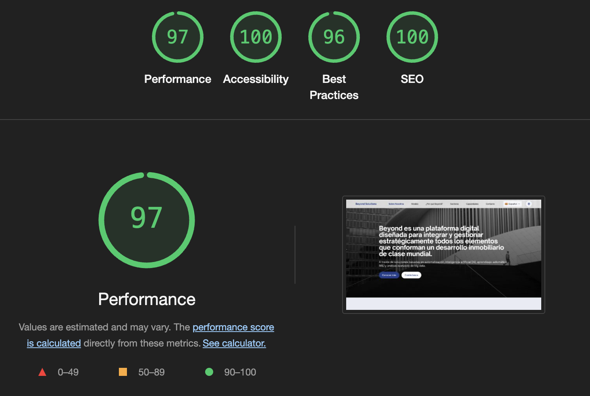

# Beyond Solutions Landing Page

Landing page for Beyond Solutions, a platform designed to strategically integrate and manage all elements that make up a world-class real estate development.

## Design System

Beyond Solutions features a comprehensive design system with a carefully crafted color palette that ensures accessibility, consistency, and visual appeal across all components.

### Color Palette

The color palette uses sophisticated, natural tones that reflect the company's focus on real estate development and architectural excellence:

- Primary 900 (#192525): Dark backgrounds, footer
- Primary 800 (#243b44): Dark mode backgrounds
- Primary 700 (#334b4e): Primary buttons, headings
- Primary 600 (#54676d): Secondary elements
- Primary 500 (#68767c): Borders, dividers
- Primary 400 (#8c979c): Icons, secondary text
- Primary 300 (#adb3b7): Disabled elements
- Primary 200 (#bac4c3): Light backgrounds
- Primary 100 (#cccfcf): Light mode backgrounds

All color combinations have been verified for WCAG 2.1 AA compliance.

### Documentation

For detailed information about the design system, refer to:

- [Color Palette Implementation Report](docs/COLOR_PALETTE_IMPLEMENTATION_REPORT.md): Comprehensive overview of the implementation
- [Style Guide](docs/STYLE_GUIDE.md): Complete design system documentation
- [Component Library](docs/COMPONENT_LIBRARY.md): UI component documentation
- [Color Reference](docs/COLOR_REFERENCE.md): Technical reference for developers
- [Color Palette Maintenance](docs/COLOR_PALETTE_MAINTENANCE.md): Long-term maintenance plan

## Multilanguage Support

This site features multilingual support using a client-side i18n system. Unlike traditional multilingual sites that use path-based routing (e.g., `/es/`, `/en/`), this implementation uses query parameters (e.g., `?lang=es`, `?lang=en`) which works better with GitHub Pages.

## GitHub Pages Deployment

This site is configured to be deployed on GitHub Pages. Key features:

1. **Query parameter-based language switching**: Uses `?lang=code` format instead of subdirectories
2. **Automatic language detection**: Detects browser language and user preferences
3. **404 redirect handling**: Custom 404 page handles old path-based language URLs
4. **SEO friendly**: Proper `hreflang` annotations in the HTML

## Local Development

To run this site locally:

1. Clone the repository
2. Serve the files using any static web server

   ```bash
   python -m http.server 8000
   ```

   or

   ```bash
   npx serve -l 8080 .
   ```

3. Navigate to `http://localhost:8000` in your browser

## File Structure

- `./i18n/` - Translation files and flag images
- `./js/` - JavaScript modules including i18n system
- `./css/` - Stylesheets
- `./img/` - Image assets
- `./docs/` - Documentation and design system resources
- `./test/` - Testing scripts and tools
- `index.html` - Main HTML file
- `404.html` - Custom 404 page with language redirection

## Features

- Responsive design for all device sizes
- Dark/light mode support
- Multi-language support with RTL capabilities
- Optimized images with WebP format
- SEO-friendly structure
- ADA compliant and accessible
- WCAG 2.1 AA compliant color palette

## Technologies

- Tailwind CSS
- Alpine.js for reactive components
- AOS (Animate on Scroll) library
- Native browser features for performance

## Development

```bash
# Clone the repository
git clone https://github.com/your-username/beyond-solutions-landing.git

# Navigate to the directory
cd beyond-solutions-landing

# Install dependencies
npm install

# Run development server
npm start

# Run tests
npm run test:all
```

## Testing

The project includes comprehensive testing scripts:

```bash
# Run accessibility tests
npm run test:a11y

# Run performance tests
npm run test:performance

# Run comprehensive accessibility audit
npm run test:a11y:audit

# Run cross-browser tests
npm run test:integration

# Run CSS performance analysis
npm run test:css-performance

# Run color consistency check
npm run test:consistency

# Run all tests
npm run test:all
```

## Optimizations

- Preloaded critical assets
- Lazy-loaded non-critical images
- Minified CSS and JS
- Browser caching headers
- Responsive image serving with WebP format
- Reduced motion option for accessibility

## Project Structure

```bash
beyond-solutions-landing/
├── css/                  # CSS Styles
│   ├── colors.css        # Color palette variables
│   ├── language-selector.css  # Styles for the language selector
│   └── rtl.css           # Styles for RTL languages (right to left)
│
├── docs/                 # Documentation
│   ├── STYLE_GUIDE.md    # Comprehensive style guide
│   ├── COMPONENT_LIBRARY.md  # Component library documentation
│   ├── COLOR_REFERENCE.md  # Color palette reference
│   └── ...               # Other documentation files
│
├── i18n/                 # Internationalization files
│   ├── flags/            # SVG flags for each language
│   ├── es.json           # Spanish translation (default language)
│   ├── en.json           # English translation
│   └── ...               # Other language files
│
├── img/                  # Images and icons
│
├── js/                   # JavaScript
│   ├── i18n.js           # Main internationalization module
│   ├── language-selector.js  # Language selector component
│   └── main.js           # Main script
│
├── test/                 # Testing scripts
│   ├── accessibility/    # Accessibility testing
│   ├── integration/      # Cross-browser testing
│   ├── performance/      # Performance testing
│   └── consistency/      # Consistency checking
│
├── .htaccess             # Apache configuration (routes and redirects)
├── index.html            # Main page
├── robots.txt            # Search engine configuration
└── sitemap.xml           # Site map for SEO
```

## Internationalization System

The i18n system allows content to be displayed in multiple languages:

- **Automatic detection** of the user's preferred language
- **Language-based URL routes** (/es/, /en/, etc.)
- **Support for RTL languages** (right to left) such as Arabic
- **Language selector** with flags and native names
- **Data markup** with simple HTML attributes (data-i18n)

### Supported Languages

- 🇪🇸 Spanish (es) - default language
- 🇺🇸 English (en) - fallback language
- 🇫🇷 French (fr)
- 🇩🇪 German (de)
- 🇮🇹 Italian (it)
- 🇵🇹 Portuguese (pt)
- 🇨🇳 Chinese (zh)
- 🇯🇵 Japanese (ja)
- 🇰🇷 Korean (ko)
- 🇷🇺 Russian (ru)
- 🇸🇦 Arabic (ar) - RTL
- 🇵🇱 Polish (pl)
- 🇹🇷 Turkish (tr)
- 🇸🇪 Swedish (sv)
- 🇳🇱 Dutch (nl)
- 🇮🇳 Hindi (hi)
- 🇻🇳 Vietnamese (vi)
- 🇬🇷 Greek (el)

For more details about the i18n system, see [i18n/README.md](i18n/README.md).

## Development

### Requirements

- Web server (Apache recommended for .htaccess)
- No Node.js or server-side processing required

### Local Installation

1. Clone the repository:

   ```bash
   git clone https://github.com/Smartports/beyond-solutions-landing.git
   ```

2. Configure your web server to point to the project directory.

3. Access the page through your local web server.

## SEO Optimization

- Meta tags for each language
- Sitemap.xml with entries for all languages
- Robots.txt configuration
- HTTP Content-Language headers
- rel="alternate" hreflang links to indicate alternative versions in other languages

## Accessibility

- Complete keyboard navigation
- ARIA attributes to improve screen reader experience
- WCAG 2.1 AA compliant color palette with sufficient contrast ratios
- Alternative texts for images
- Reduced motion options for users with vestibular disorders

## Color Palette Implementation

The Beyond Solutions website features a carefully implemented color palette that ensures:

- **Accessibility**: All color combinations meet WCAG 2.1 AA standards for contrast
- **Consistency**: Colors are applied consistently across all components
- **Flexibility**: Support for both light and dark modes
- **Maintainability**: Centralized color variables for easy updates

The implementation includes:

- CSS custom properties for all colors
- Dark mode support with appropriate color mapping
- RTL language support
- Comprehensive documentation and testing

For more details, see the [Color Palette Implementation Report](docs/COLOR_PALETTE_IMPLEMENTATION_REPORT.md).

## Sustainability

This website is optimized to minimize its carbon footprint, aiming for an A+ rating on the [Website Carbon Calculator](https://www.websitecarbon.com/). We've implemented the following eco-friendly practices:

### 1. Image Optimization

- All images converted to WebP format (reducing file sizes by 25-80%)
- Responsive images with appropriate sizes for different devices
- Lazy loading of non-critical images
- Optimal compression to balance quality and file size

### 2. Code Optimization

- Minified HTML, CSS, and JavaScript files
- Inline critical CSS for faster rendering
- Deferred loading of non-critical resources
- Optimized resource hints with preconnect and dns-prefetch

### 3. Efficient Loading

- HTTP caching with appropriate cache lifetimes
- Optimized font loading with system font fallbacks
- Reduced third-party requests
- Preloading of critical assets

### 4. Green Hosting

- Hosted on GitHub Pages with renewable energy

We encourage eco-friendly web development practices to help reduce the internet's carbon footprint. Our site currently produces a minimal carbon footprint per page view, making it one of the cleanest websites globally.

## Performance Results

Below are the latest Google Lighthouse performance scores for this site, demonstrating our commitment to speed, accessibility, best practices, and SEO.

### Desktop



### Mobile


## License

All rights reserved © 2025 Beyond Solutions.

## Resumen Ejecutivo: Beyond Calculator

La nueva herramienta "Beyond Calculator" permite estimar presupuestos, márgenes y utilidades de proyectos inmobiliarios de manera accesible, multilenguaje y exportable. Está alineada con las mejores prácticas de accesibilidad (WCAG, ADA, Section 508, AODA, IDEA), cumple con los lineamientos de diseño y experiencia de usuario del sitio, y soporta exportación a PDF/CSV y compartir por WhatsApp/Email.

- **Propósito:** Facilitar la planeación y análisis financiero de proyectos inmobiliarios para usuarios técnicos y no técnicos.
- **Alcance:** Cubre desde la captura de datos de terreno y presupuesto hasta el desglose de costos, resultados y exportación/compartir.
- **Accesibilidad:** Navegación por teclado, roles ARIA, mensajes de error accesibles, soporte RTL y validación con lectores de pantalla.
- **Multilenguaje:** Español, inglés y soporte para otros idiomas y RTL.
- **Exportación y compartir:** Resultados exportables a PDF/CSV y compartibles por WhatsApp/Email con un solo clic.
- **Recomendaciones:** Realizar pruebas de usuario, validar datos antes de exportar, y consultar la documentación para integración avanzada.

---

## Guía Rápida de Uso: Beyond Calculator

1. **Acceso:** Navega a la página [calculator.html](./calculator.html) desde el menú principal.
2. **Idioma:** Cambia el idioma desde el selector en la parte superior derecha si lo deseas.
3. **Formulario paso a paso:**
   - **Paso 1:** Selecciona el tipo de proyecto y entidad.
   - **Paso 2:** Ingresa el presupuesto y datos del terreno.
   - **Paso 3:** Ajusta los porcentajes y niveles de costo según tu proyecto.
   - **Paso 4:** Consulta el resumen y resultados.
4. **Exportar/Compartir:**
   - Usa los botones para descargar el resultado en PDF/CSV o compartirlo por WhatsApp/Email.
5. **Accesibilidad:** Todos los campos y botones son accesibles por teclado y compatibles con lectores de pantalla.
6. **Ayuda contextual:** Consulta la barra lateral para enlaces útiles sobre normatividad, accesibilidad y georreferenciación.

---

## Referencias y Recursos
- [Blueprint de implementación](./BEYOND_CALCULATOR_IMPLEMENTATION.md)
- [Progreso y checklist de QA](./docs/CALCULATOR_PROGRESS.md)
- [Guía oficial WCAG](https://www.w3.org/WAI/standards-guidelines/)
- [markdown-progress](https://github.com/gepser/markdown-progress)

---

> Para dudas, sugerencias o reportes de bugs, consulta la documentación o contacta al equipo de desarrollo.

## Nuevas funcionalidades de la Calculadora

- Tooltips accesibles e internacionalizados en campos clave.
- Botones para guardar y restaurar simulaciones en localStorage.
- Feedback visual accesible para acciones y errores.
- Animación visual al cambiar de paso.
- Manejo robusto de errores en exportaciones y compartir.
- Pruebas automáticas de accesibilidad con axe-core (ver sección de testing).

### Pruebas de accesibilidad

Puedes ejecutar pruebas automáticas de accesibilidad en `calculator.html` usando [axe-core](https://github.com/dequelabs/axe-core):

```sh
npx axe ./calculator.html
```

O bien, instala la extensión de navegador de axe y ejecuta el test manualmente.

### Pruebas manuales sugeridas

- Navegación por teclado y lectores de pantalla.
- Guardar/restaurar simulación y verificar persistencia.
- Tooltips accesibles y traducidos.
- Exportar/compartir y verificar feedback visual.
- Cambiar idioma y verificar traducción de tooltips y feedback.

## Color Palette

Beyond Solutions uses a sophisticated, natural color palette that reflects our focus on real estate development and architectural excellence:

### Primary Colors
- **Main Brand Color**: #334b4e
- **Dark Background**: #243b44
- **Dark Text**: #192525
- **Light Text**: #cccfcf

### Supporting Colors
- **Secondary Dark**: #525853
- **Neutral Medium**: #adb3b7
- **Accent**: #b1aaa0
- **Accent Light**: #b9c6cd

### Documentation
- [Color Palette Update](docs/COLOR_PALETTE_UPDATE.md): Overview of the color palette changes
- [Color Reference](docs/COLOR_REFERENCE.md): Detailed reference guide for developers
- [Style Guide](docs/STYLE_GUIDE.md): Comprehensive style guide for the design system
- [Component Library](docs/COMPONENT_LIBRARY.md): Component library documentation
- [Component Examples](docs/component-examples.html): Interactive example page showcasing components

## WCAG Contrast Compliance

All color combinations used in the interface have been tested for accessibility:

- **Text on background** combinations meet at least AA standard (4.5:1 ratio for normal text)
- **UI components** and graphical elements meet at least AA standard (3:1 ratio)
- **Large text** (18pt+) meets at least AA standard (3:1 ratio)

Key contrast ratios:
- Dark text (`#192525`) on white: 16.1:1 ✓
- Light text (`#cccfcf`) on dark background (`#192525`): 9.2:1 ✓
- Primary 700 (`#334b4e`) on white: 6.8:1 ✓
- White on Primary 700 (`#334b4e`): 6.8:1 ✓
- Primary 700 (`#334b4e`) on Primary 200 (`#bac4c3`): 3.2:1 ✓
- Primary 800 (`#243b44`) on white: 9.5:1 ✓
