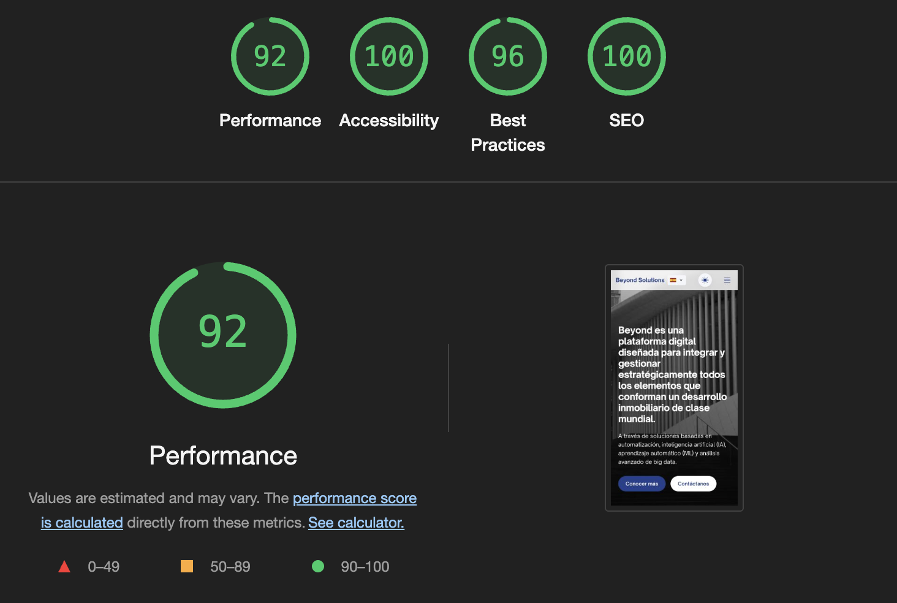

# Beyond Solutions Landing Page

Landing page for Beyond Solutions, a platform designed to strategically integrate and manage all elements that make up a world-class real estate development.

## Multilanguage Support

This site features multilingual support using a client-side i18n system. Unlike traditional multilingual sites that use path-based routing (e.g., `/es/`, `/en/`), this implementation uses query parameters (e.g., `?lang=es`, `?lang=en`) which works better with GitHub Pages.

## GitHub Pages Deployment

This site is configured to be deployed on GitHub Pages. Key features:

1. **Query parameter-based language switching**: Uses `?lang=code` format instead of subdirectories
2. **Automatic language detection**: Detects browser language and user preferences
3. **404 redirect handling**: Custom 404 page handles old path-based language URLs
4. **SEO friendly**: Proper `hreflang` annotations in the HTML

## Local Development

To run this site locally:

1. Clone the repository
2. Serve the files using any static web server

   ```bash
   python -m http.server 8000
   ```

3. Navigate to `http://localhost:8000` in your browser

## File Structure

- `./i18n/` - Translation files and flag images
- `./js/` - JavaScript modules including i18n system
- `./css/` - Stylesheets
- `./img/` - Image assets
- `index.html` - Main HTML file
- `404.html` - Custom 404 page with language redirection

## Features

- Responsive design optimized for all devices
- Light/dark theme based on user preferences
- Complete internationalization (i18n) system with 18 languages
- Language-based routes for SEO (/es/, /en/, etc.)
- Performance and accessibility optimization

## Project Structure

```bash
beyond-solutions-landing/
├── css/                  # CSS Styles
│   ├── language-selector.css  # Styles for the language selector
│   └── rtl.css           # Styles for RTL languages (right to left)
│
├── i18n/                 # Internationalization files
│   ├── flags/            # SVG flags for each language
│   ├── es.json           # Spanish translation (default language)
│   ├── en.json           # English translation
│   └── ...               # Other language files
│
├── img/                  # Images and icons
│
├── js/                   # JavaScript
│   ├── i18n.js           # Main internationalization module
│   ├── language-selector.js  # Language selector component
│   └── main.js           # Main script
│
├── .htaccess             # Apache configuration (routes and redirects)
├── index.html            # Main page
├── robots.txt            # Search engine configuration
└── sitemap.xml           # Site map for SEO
```

## Internationalization System

The i18n system allows content to be displayed in multiple languages:

- **Automatic detection** of the user's preferred language
- **Language-based URL routes** (/es/, /en/, etc.)
- **Support for RTL languages** (right to left) such as Arabic
- **Language selector** with flags and native names
- **Data markup** with simple HTML attributes (data-i18n)

### Supported Languages

- 🇪🇸 Spanish (es) - default language
- 🇺🇸 English (en) - fallback language
- 🇫🇷 French (fr)
- 🇩🇪 German (de)
- 🇮🇹 Italian (it)
- 🇵🇹 Portuguese (pt)
- 🇨🇳 Chinese (zh)
- 🇯🇵 Japanese (ja)
- 🇰🇷 Korean (ko)
- 🇷🇺 Russian (ru)
- 🇸🇦 Arabic (ar) - RTL
- 🇵🇱 Polish (pl)
- 🇹🇷 Turkish (tr)
- 🇸🇪 Swedish (sv)
- 🇳🇱 Dutch (nl)
- 🇮🇳 Hindi (hi)
- 🇻🇳 Vietnamese (vi)
- 🇬🇷 Greek (el)

For more details about the i18n system, see [i18n/README.md](i18n/README.md).

## Development

### Requirements

- Web server (Apache recommended for .htaccess)
- No Node.js or server-side processing required

### Local Installation

1. Clone the repository:

   ```bash
   git clone https://github.com/Smartports/beyond-solutions-landing.git
   ```

2. Configure your web server to point to the project directory.

3. Access the page through your local web server.

## SEO Optimization

- Meta tags for each language
- Sitemap.xml with entries for all languages
- Robots.txt configuration
- HTTP Content-Language headers
- rel="alternate" hreflang links to indicate alternative versions in other languages

## Accessibility

- Complete keyboard navigation
- ARIA attributes to improve screen reader experience
- Appropriate color contrast
- Alternative texts for images

## Sustainability

This website is optimized to minimize its carbon footprint, aiming for an A+ rating on the [Website Carbon Calculator](https://www.websitecarbon.com/). We've implemented the following eco-friendly practices:

### 1. Image Optimization

- All images converted to WebP format (reducing file sizes by 25-80%)
- Responsive images with appropriate sizes for different devices
- Lazy loading of non-critical images
- Optimal compression to balance quality and file size

### 2. Code Optimization

- Minified HTML, CSS, and JavaScript files
- Inline critical CSS for faster rendering
- Deferred loading of non-critical resources
- Optimized resource hints with preconnect and dns-prefetch

### 3. Efficient Loading

- HTTP caching with appropriate cache lifetimes
- Optimized font loading with system font fallbacks
- Reduced third-party requests
- Preloading of critical assets

### 4. Green Hosting

- Hosted on GitHub Pages with renewable energy

We encourage eco-friendly web development practices to help reduce the internet's carbon footprint. Our site currently produces a minimal carbon footprint per page view, making it one of the cleanest websites globally.

## Performance Results

Below are the latest Google Lighthouse performance scores for this site, demonstrating our commitment to speed, accessibility, best practices, and SEO.

### Desktop


### Mobile



## License

All rights reserved © 2025 Beyond Solutions.
