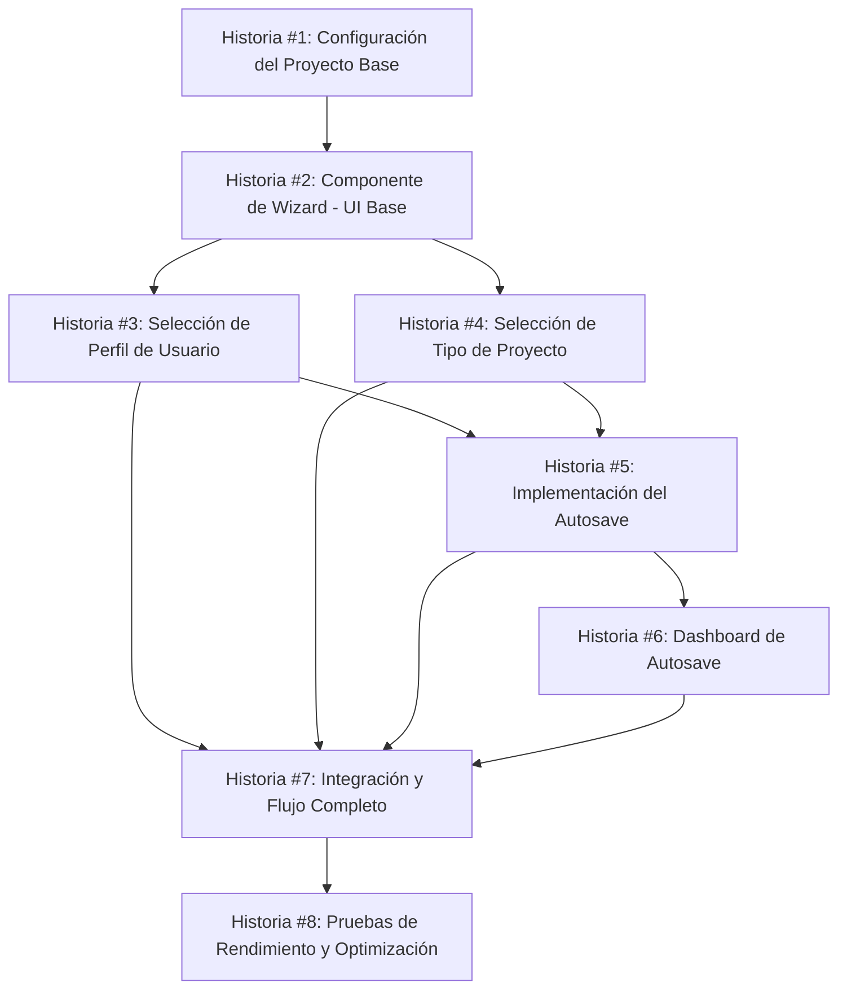

# Plan de Implementación: E1 - Wizard/Onboarding (Sprint 1)

> **Propósito**: Este documento presenta el plan detallado de implementación para la Épica E1 (Wizard/Onboarding) durante el Sprint 1 del proyecto de calculadora inmobiliaria v2. Servirá como guía y registro del progreso para garantizar una entrega exitosa.

## Visión General

Epic E1 busca crear un proceso de onboarding con un wizard de 2 preguntas para capturar el perfil del usuario y tipo de proyecto en menos de 60 segundos, con componentes clave `Wizard2Q` y `DashboardAutosave`.

## Registro de Estado

| Fecha | Estado | Notas |
|-------|--------|-------|
| [FECHA_ACTUAL] | Planeado | Plan inicial creado |

## Historias de Usuario

### Historia #1: Configuración del Proyecto Base

**Objetivo:** Establecer la estructura base del proyecto para la calculadora inmobiliaria v2.

**Estado:** 📝 Pendiente

**Tareas:**
- [ ] Inicializar el proyecto con estructura de carpetas `apps/web`, `packages/ui`, `packages/core`
- [ ] Configurar Tailwind CSS con tema personalizado y tokens de diseño
- [ ] Configurar IndexedDB y LocalStorage para autosave
- [ ] Configurar i18n para soporte multilenguaje
- [ ] Preparar linting y formateo de código
- [ ] Configurar build y deploy pipeline

**Criterios de Aceptación:**
- [ ] Proyecto inicializado y estructura correctamente organizada
- [ ] Tailwind configurado con tokens de diseño
- [ ] Implementación básica de IndexedDB lista para usar
- [ ] Sistema i18n funcionando con al menos español e inglés
- [ ] Linting y formateo configurados con GitHub Actions
- [ ] Build exitoso y despliegue automático en Vercel

**Dependencias:** Ninguna

**Desarrollador Asignado:** Edgar

### Historia #2: Componente de Wizard - UI Base

**Objetivo:** Crear el componente base del wizard con navegación entre pasos.

**Estado:** 📝 Pendiente

**Tareas:**
- [ ] Diseñar la estructura de componentes para el wizard
- [ ] Implementar el layout responsive del wizard
- [ ] Crear sistema de navegación entre pasos
- [ ] Implementar indicador de progreso
- [ ] Crear componente de botones de navegación
- [ ] Agregar animaciones de transición entre pasos

**Criterios de Aceptación:**
- [ ] Navegación entre pasos funciona correctamente (adelante/atrás)
- [ ] Indicador de progreso muestra paso actual
- [ ] Layout responsive se adapta a móvil, tablet y desktop
- [ ] Animaciones de transición funcionan en dispositivos con/sin preferencia de movimiento reducido
- [ ] El componente cumple con WCAG 2.1 AA (contraste, navegación por teclado)
- [ ] LCP menor a 2.5s en dispositivos de gama media

**Dependencias:** Historia #1

**Desarrollador Asignado:** Edgar

### Historia #3: Selección de Perfil de Usuario

**Objetivo:** Implementar la primera pregunta del wizard para selección de perfil de usuario.

**Estado:** 📝 Pendiente

**Tareas:**
- [ ] Diseñar la UI para selección de perfil (Desarrollador, Propietario, Inversionista, Arquitecto)
- [ ] Implementar selección visual con iconos y descripciones
- [ ] Crear validaciones del formulario con react-hook-form y zod
- [ ] Implementar estado para almacenar la selección
- [ ] Agregar traducciones para cada opción

**Criterios de Aceptación:**
- [ ] Usuario puede seleccionar uno de los 4 perfiles
- [ ] Cada perfil tiene icono, título y breve descripción
- [ ] La selección se guarda correctamente en el estado
- [ ] Se muestran validaciones si el usuario intenta continuar sin seleccionar
- [ ] El componente es completamente accesible (keyboard navigation, screen readers)
- [ ] Tests unitarios cubren todos los casos de selección

**Dependencias:** Historia #2

**Desarrollador Asignado:** Edgar

### Historia #4: Selección de Tipo de Proyecto

**Objetivo:** Implementar la segunda pregunta del wizard para selección del tipo de proyecto.

**Estado:** 📝 Pendiente

**Tareas:**
- [ ] Diseñar la UI para selección de tipo de proyecto (Residencial, Comercial, Mixto, Industrial)
- [ ] Implementar selección visual con iconos y descripciones
- [ ] Crear validaciones del formulario
- [ ] Implementar estado para almacenar la selección
- [ ] Agregar traducciones para cada opción

**Criterios de Aceptación:**
- [ ] Usuario puede seleccionar uno de los 4 tipos de proyecto
- [ ] Cada tipo tiene icono, título y breve descripción
- [ ] La selección se guarda correctamente en el estado
- [ ] Se muestran validaciones si el usuario intenta continuar sin seleccionar
- [ ] El componente es completamente accesible
- [ ] Tests unitarios cubren todos los casos de selección

**Dependencias:** Historia #2

**Desarrollador Asignado:** Edgar

### Historia #5: Implementación del Autosave

**Objetivo:** Crear sistema de guardado automático para preservar las selecciones del usuario.

**Estado:** 📝 Pendiente

**Tareas:**
- [ ] Diseñar la estructura de datos para IndexedDB
- [ ] Implementar listeners para guardar cambios automáticamente
- [ ] Crear función de recuperación de datos al iniciar la aplicación
- [ ] Implementar sistema de versiones para migraciones futuras
- [ ] Agregar feedback visual cuando se guarda automáticamente
- [ ] Crear mecanismo de recuperación ante errores

**Criterios de Aceptación:**
- [ ] Los datos se guardan automáticamente en IndexedDB al cambiar
- [ ] Al recargar la página, los datos se recuperan correctamente
- [ ] El usuario recibe feedback visual sutil cuando se guarda (toast o indicador)
- [ ] La función de recuperación maneja correctamente cuando no hay datos previos
- [ ] Tests que verifican persistencia de datos entre recargas
- [ ] Rendimiento: operaciones de guardado no bloquean la UI

**Dependencias:** Historias #3 y #4

**Desarrollador Asignado:** Edgar

### Historia #6: Dashboard de Autosave

**Objetivo:** Crear el componente Dashboard para mostrar y gestionar proyectos autosave.

**Estado:** 📝 Pendiente

**Tareas:**
- [ ] Diseñar UI para el dashboard de proyectos guardados
- [ ] Implementar lista de proyectos con miniaturas y metadatos
- [ ] Crear funcionalidad para crear nuevo proyecto
- [ ] Implementar funcionalidad para eliminar proyectos
- [ ] Agregar opción para exportar/importar proyectos
- [ ] Implementar filtros y búsqueda básica

**Criterios de Aceptación:**
- [ ] Dashboard muestra todos los proyectos guardados
- [ ] Usuario puede crear un nuevo proyecto
- [ ] Usuario puede eliminar proyectos existentes (con confirmación)
- [ ] Usuario puede exportar un proyecto como JSON
- [ ] Usuario puede importar un proyecto desde JSON
- [ ] Tests de integración verifican las operaciones CRUD

**Dependencias:** Historia #5

**Desarrollador Asignado:** Edgar

### Historia #7: Integración y Flujo Completo

**Objetivo:** Integrar todos los componentes para crear el flujo completo del wizard a dashboard.

**Estado:** 📝 Pendiente

**Tareas:**
- [ ] Integrar el wizard con el sistema de autosave
- [ ] Conectar la finalización del wizard con la redirección al dashboard
- [ ] Implementar la navegación entre dashboard y wizard
- [ ] Crear el flujo para editar un proyecto existente
- [ ] Implementar la lógica para pasar a la siguiente fase
- [ ] Agregar animaciones de transición entre pantallas principales

**Criterios de Aceptación:**
- [ ] Usuario completa el wizard y es redirigido al dashboard
- [ ] Usuario puede volver al wizard desde el dashboard
- [ ] La edición de un proyecto existente carga correctamente los datos previos
- [ ] El sistema muestra correctamente el estado guardado vs no guardado
- [ ] Al completar el wizard se habilita el paso a la fase 2
- [ ] Tests E2E verifican el flujo completo de onboarding

**Dependencias:** Historias #3, #4, #5, #6

**Desarrollador Asignado:** Edgar

### Historia #8: Pruebas de Rendimiento y Optimización

**Objetivo:** Garantizar que el wizard y dashboard cumplen con los requisitos de rendimiento y accesibilidad.

**Estado:** 📝 Pendiente

**Tareas:**
- [ ] Ejecutar pruebas de rendimiento en diferentes dispositivos
- [ ] Implementar lazy loading para componentes no críticos
- [ ] Optimizar imágenes y assets
- [ ] Realizar pruebas de accesibilidad con screen readers
- [ ] Verificar cumplimiento de WCAG 2.1 AA
- [ ] Optimizar el tamaño del bundle

**Criterios de Aceptación:**
- [ ] LCP menor a 2.5s en dispositivos de gama media
- [ ] Score de Lighthouse >90 en Performance, Accessibility y Best Practices
- [ ] Pruebas con screen readers no detectan problemas de accesibilidad
- [ ] Tamaño total del bundle inicial menor a 250KB (sin imágenes)
- [ ] Pruebas de integración demuestran fluidez en dispositivos objetivo
- [ ] Primera interacción disponible en <3s

**Dependencias:** Historia #7

**Desarrollador Asignado:** Edgar

## Riesgos y Mitigaciones

### Riesgo 1: Complejidad del Sistema de Autosave
**Descripción:** La implementación del sistema de guardado automático puede ser más compleja de lo previsto, especialmente para manejar conflictos y versiones.

**Mitigación:**
- Comenzar con un MVP de autosave simple y expandir funcionalidades iterativamente
- Implementar un sistema de versionado desde el inicio
- Crear pruebas extensivas para casos límite
- Tener un fallback a LocalStorage si IndexedDB falla

**Estado:** 🔍 Monitorizado

### Riesgo 2: Rendimiento en Dispositivos Móviles
**Descripción:** El rendimiento del wizard puede degradarse en dispositivos móviles de gama baja.

**Mitigación:**
- Implementar code splitting para reducir bundle inicial
- Optimizar assets agresivamente para dispositivos móviles
- Implementar estrategia de carga progresiva
- Agregar monitoreo de performance en tiempo real
- Tener una versión "lite" del wizard como fallback

**Estado:** 🔍 Monitorizado

### Riesgo 3: Complejidad de Internacionalización
**Descripción:** La implementación de i18n puede complicarse con textos dinámicos y diferentes longitudes de texto.

**Mitigación:**
- Utilizar un sistema de diseño flexible que se adapte a diferentes longitudes de texto
- Implementar pruebas específicas para verificar layouts con diferentes idiomas
- Comenzar con dos idiomas principales (ES/EN) antes de expandir
- Implementar un proceso de revisión de traducciones para detectar problemas de UI

**Estado:** 🔍 Monitorizado

### Riesgo 4: Integración con Fases Posteriores
**Descripción:** La arquitectura inicial podría no ser óptima para las necesidades de fases posteriores más complejas (como la visualización 3D).

**Mitigación:**
- Reuniones de arquitectura para revisar decisiones con enfoque en fases futuras
- Mantener separación clara entre UI, lógica de negocio y estado
- Implementar interfaces bien definidas para componentes que se usarán en fases posteriores
- Crear documentación detallada de la arquitectura y decisiones de diseño

**Estado:** 🔍 Monitorizado

## Estimación Total del Sprint

| Historia | Estimación (días) | Estado |
|----------|------------------|--------|
| #1: Configuración del Proyecto Base | 1.0 | 📝 Pendiente |
| #2: Componente de Wizard - UI Base | 1.0 | 📝 Pendiente |
| #3: Selección de Perfil de Usuario | 0.5 | 📝 Pendiente |
| #4: Selección de Tipo de Proyecto | 0.5 | 📝 Pendiente |
| #5: Implementación del Autosave | 1.0 | 📝 Pendiente |
| #6: Dashboard de Autosave | 1.0 | 📝 Pendiente |
| #7: Integración y Flujo Completo | 0.5 | 📝 Pendiente |
| #8: Pruebas de Rendimiento y Optimización | 0.5 | 📝 Pendiente |
| **Total** | **6.0** | 📝 **Pendiente** |

## Leyenda de Estado

- 📝 Pendiente: No iniciado
- 🏗️ En progreso: Desarrollo activo
- 🔍 Revisión: En proceso de revisión (PR abierto)
- ✅ Completado: Integrado en main y desplegado
- ❌ Bloqueado: No se puede avanzar debido a dependencias o problemas

## Diagrama de Dependencias

## Próximos Pasos

1. Revisión del plan con el equipo completo
2. Asignación de desarrolladores a cada historia
3. Configuración de proyecto base (Historia #1)
4. Actualización diaria del estado en este documento

---

> Este plan está sujeto a ajustes según el feedback del equipo y los desafíos encontrados durante la implementación. 