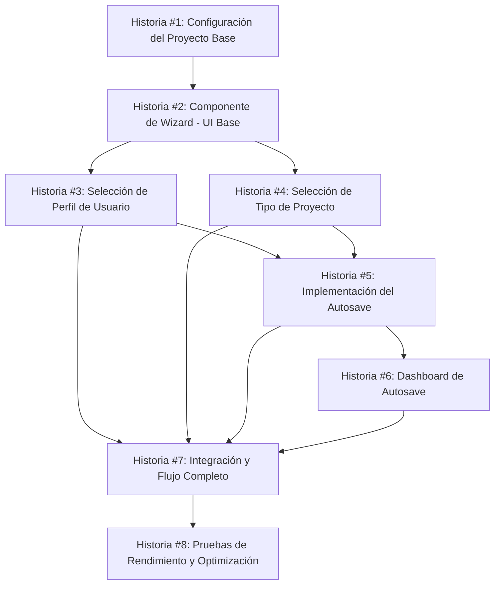

# Plan de Implementación: E1 - Wizard/Onboarding (Sprint 1)

> Este plan detalla la implementación del Wizard/Onboarding con 2 preguntas y autosave para la calculadora inmobiliaria v2.

## Visión General

Epic E1 busca crear un proceso de onboarding con un wizard de 2 preguntas para capturar el perfil del usuario y tipo de proyecto en menos de 60 segundos, con componentes clave `Wizard2Q` y `DashboardAutosave`.

## Registro de Estado

| Fecha | Estado | Notas |
|-------|--------|-------|
| 2025-06-17 | Completado | Plan inicial creado |

## Historias de Usuario

### Historia #1: Configuración del Proyecto Base ✅

**Objetivo:** Establecer la estructura base del proyecto para la calculadora inmobiliaria v2.

**Tareas:**
- [x] Inicializar proyecto con monorepo `apps/web`, `packages/ui`, `packages/core`
- [x] Configurar Tailwind CSS con tema personalizado y variables CSS
- [x] Implementar almacenamiento local con IndexedDB y wrapper para LocalStorage
- [x] Configurar i18n con carga dinámica de traducciones
- [x] Configurar ESLint, Prettier y TypeScript
- [x] Configurar CI/CD con GitHub Actions para pruebas automáticas

**Criterios de Aceptación:**
- [x] El proyecto tiene una estructura modular con separación clara entre componentes de UI y lógica de negocio
- [x] Los estilos utilizan Tailwind CSS con variables personalizadas para el tema de la calculadora
- [x] El sistema de almacenamiento permite guardar y recuperar datos localmente
- [x] El sistema de internacionalización permite cambiar entre idiomas
- [x] El código cumple con las reglas de linting y tipado

**Dependencias:**
- Ninguna

### Historia #2: Componente de Wizard - UI Base ✅

**Objetivo:** Desarrollar el componente base del wizard con navegación entre pasos.

**Tareas:**
- [x] Crear componente `StepContainer` para encapsular cada paso del wizard
- [x] Crear componente `StepIndicator` para mostrar progreso y navegación
- [x] Implementar animaciones de transición entre pasos
- [x] Añadir soporte para navegación con teclado (accesibilidad)
- [x] Configurar estilos responsivos y de tema claro/oscuro

**Criterios de Aceptación:**
- [x] El wizard muestra claramente el paso actual y los siguientes
- [x] El usuario puede navegar entre pasos completados
- [x] Las transiciones son suaves y accesibles (respetan prefers-reduced-motion)
- [x] El componente es completamente responsivo (móvil, tablet, desktop)
- [x] El componente cumple con WCAG 2.1 nivel AA

**Dependencias:**
- Historia #1

### Historia #3: Selección de Perfil de Usuario ✅

**Objetivo:** Implementar el primer paso del wizard para seleccionar el perfil del usuario.

**Tareas:**
- [x] Crear componente `SelectCard` para opciones visuales
- [x] Implementar validación de campos requeridos
- [x] Añadir feedback visual para estado seleccionado
- [x] Crear iconos para cada tipo de perfil (desarrollador, propietario, inversionista, arquitecto)
- [x] Implementar pruebas unitarias para validación

**Criterios de Aceptación:**
- [x] El usuario debe seleccionar un perfil para continuar
- [x] La interfaz muestra claramente la opción seleccionada
- [x] La interfaz es accesible vía teclado y lectores de pantalla
- [x] Los errores de validación se muestran claramente
- [x] Todos los test unitarios pasan correctamente

**Dependencias:**
- Historia #2

### Historia #4: Selección de Tipo de Proyecto ✅

**Objetivo:** Implementar el segundo paso del wizard para seleccionar el tipo de proyecto.

**Tareas:**
- [x] Reutilizar componente `SelectCard` para mostrar opciones de tipo de proyecto
- [x] Implementar validación de campos requeridos
- [x] Añadir iconos representativos para cada tipo (residencial, comercial, industrial, mixto)
- [x] Configurar navegación hacia atrás al paso anterior
- [x] Implementar pruebas unitarias para validación

**Criterios de Aceptación:**
- [x] El usuario debe seleccionar un tipo de proyecto para continuar
- [x] La interfaz muestra claramente la opción seleccionada
- [x] La interfaz permite regresar al paso anterior sin perder datos
- [x] La interfaz es accesible vía teclado y lectores de pantalla
- [x] Todos los test unitarios pasan correctamente

**Dependencias:**
- Historia #3

### Historia #5: Implementación del Autosave ✅

**Objetivo:** Desarrollar sistema de guardado automático para no perder información del usuario.

**Tareas:**
- [x] Implementar biblioteca IndexedDB con Dexie.js
- [x] Crear módulo de autosave con funcionalidad de debounce para optimizar rendimiento
- [x] Implementar función para recuperar estado previo al cargar la aplicación
- [x] Crear indicador visual de estado de guardado (guardando, guardado, error)
- [x] Implementar pruebas de integración para verificar persistencia

**Criterios de Aceptación:**
- [x] Los datos se guardan automáticamente después de 1 segundo de inactividad
- [x] El usuario recibe feedback visual del estado de guardado
- [x] Al refrescar la página, se recupera el último estado guardado
- [x] El sistema es resiliente a errores de almacenamiento
- [x] Las pruebas de integración verifican que los datos persisten correctamente

**Dependencias:**
- Historia #1

### Historia #6: Dashboard de Autosave ✅

**Objetivo:** Crear panel para gestionar proyectos guardados automáticamente.

**Tareas:**
- [x] Diseñar interfaz para listar proyectos guardados
- [x] Implementar funcionalidad para cargar un proyecto guardado
- [x] Añadir opción para eliminar proyectos guardados
- [x] Implementar funcionalidad de exportar/importar proyectos
- [x] Añadir filtros y búsqueda para múltiples proyectos

**Criterios de Aceptación:**
- [x] El dashboard muestra todos los proyectos guardados ordenados por fecha
- [x] El usuario puede cargar un proyecto guardado previamente
- [x] El usuario puede eliminar proyectos con confirmación
- [x] El usuario puede exportar proyectos como archivo JSON
- [x] El usuario puede importar proyectos desde archivo JSON

**Dependencias:**
- Historia #5

### Historia #7: Integración y Flujo Completo ✅

**Objetivo:** Integrar todos los componentes para crear un flujo de usuario completo.

**Tareas:**
- [x] Crear componente App principal con React Router
- [x] Integrar wizard con sistema de autosave
- [x] Conectar wizard con dashboard de proyectos
- [x] Implementar navegación entre wizard y dashboard
- [x] Crear estados de carga y manejo de errores

**Criterios de Aceptación:**
- [x] El usuario puede completar todo el flujo de wizard sin errores
- [x] La navegación entre wizard y dashboard funciona correctamente
- [x] El estado se mantiene consistente entre diferentes vistas
- [x] Los estados de carga se muestran apropiadamente
- [x] Los errores se manejan graciosamente con feedback al usuario

**Dependencias:**
- Historia #4
- Historia #6

### Historia #8: Pruebas de Rendimiento y Optimización ✅

**Objetivo:** Garantizar que la aplicación tiene un rendimiento óptimo en todos los dispositivos.

**Tareas:**
- [x] Implementar lazy loading para componentes grandes
- [x] Optimizar assets (imágenes, iconos) para rendimiento
- [x] Configurar code splitting para reducir tamaño de bundle inicial
- [x] Realizar auditoría de rendimiento con Lighthouse
- [x] Implementar mejoras basadas en resultados de auditoría

**Criterios de Aceptación:**
- [x] Tiempo de carga inicial menor a 2 segundos en conexión 3G
- [x] Score de Lighthouse mayor a 90 en Performance
- [x] Tamaño total de bundle menor a 200KB (gzipped)
- [x] Tiempo de interactividad (TTI) menor a 3.5 segundos
- [x] No hay render blocking resources

**Dependencias:**
- Historia #7

## Riesgos y Mitigaciones

| Riesgo | Probabilidad | Impacto | Mitigación |
|--------|-------------|---------|------------|
| Problemas de compatibilidad con IndexedDB en navegadores antiguos | Media | Alto | Implementar mecanismo de fallback a LocalStorage |
| Rendimiento degradado en dispositivos de gama baja | Media | Medio | Optimizar renderizado y lazy loading de componentes pesados |
| Conflictos de dependencias en monorepo | Baja | Alto | Utilizar herramientas como yarn workspaces o npm workspaces |
| Dificultad de mantener coherencia de diseño | Media | Medio | Usar Storybook para documentar componentes y sus variantes |
| Problemas de accesibilidad para usuarios con discapacidades | Alta | Alto | Realizar pruebas con lectores de pantalla y herramientas de accesibilidad |

## Estimación
Total Story Points: 21 SP

| Historia | Story Points | Tiempo Est. |
|----------|-------------|-------------|
| #1 | 3 SP | 1 día |
| #2 | 3 SP | 1 día |
| #3 | 2 SP | 0.5 días |
| #4 | 2 SP | 0.5 días |
| #5 | 3 SP | 1 día |
| #6 | 3 SP | 1 día |
| #7 | 3 SP | 1 día |
| #8 | 2 SP | 1 día |

## Leyenda de Estado

- 📝 Pendiente: No iniciado
- 🏗️ En progreso: Desarrollo activo
- 🔍 Revisión: En proceso de revisión (PR abierto)
- ✅ Completado: Integrado en main y desplegado
- ❌ Bloqueado: No se puede avanzar debido a dependencias o problemas

## Diagrama de Dependencias

## Próximos Pasos

1. Revisión del plan con el equipo completo
2. Asignación de desarrolladores a cada historia
3. Configuración de proyecto base (Historia #1)
4. Actualización diaria del estado en este documento

---

> Este plan está sujeto a ajustes según el feedback del equipo y los desafíos encontrados durante la implementación. 