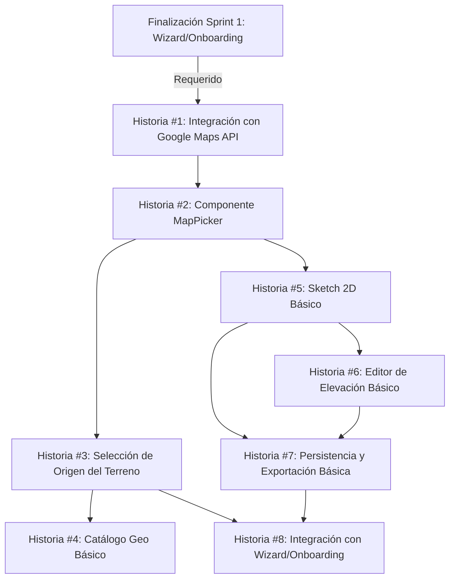

# Plan de Implementación: E2 - Terreno MVP (Sprint 2)

> **Propósito**: Este documento presenta el plan detallado de implementación para la Épica E2 (Terreno) MVP durante el Sprint 2 del proyecto de calculadora inmobiliaria v2. Servirá como guía y registro del progreso para garantizar una entrega exitosa del mapa y sketch 2D.

## Visión General

La Épica E2 busca permitir a los usuarios seleccionar o dibujar un terreno y generar su geometría low-poly. En este Sprint 2 nos enfocamos en entregar el MVP con los componentes clave `MapPicker` y `Sketch2D`, dejando `ImportCAD` y `Vista3D` para el Sprint 3.

## Registro de Estado

| Fecha | Estado | Notas |
|-------|--------|-------|
| 2025-06-16 | Planeado | Plan inicial creado |
| 2025-06-17 | Completado | Todas las historias de usuario implementadas |

## Historias de Usuario

### Historia #1: Integración con Google Maps API

**Objetivo:** Implementar la integración base con Google Maps Platform para visualización y selección de terrenos.

**Estado:** ✅ Completado

**Tareas:**
- [x] Configurar proyecto en Google Cloud Console
- [x] Obtener y configurar API Keys para Maps JavaScript API
- [x] Implementar componente base de mapa interactivo
- [x] Configurar geocoding para búsqueda de direcciones
- [x] Agregar limitaciones de zoom y área de interés
- [x] Implementar estado para guardar coordenadas seleccionadas

**Criterios de Aceptación:**
- [x] Mapa se carga correctamente con API de Google Maps
- [x] Usuario puede buscar ubicaciones por dirección o nombre
- [x] El mapa es responsive en diferentes dispositivos
- [x] Las API Keys están securizadas apropiadamente
- [x] Las coordenadas seleccionadas se guardan en el estado
- [x] El sistema maneja correctamente errores de carga de API

**Dependencias:** Integración con autosave del Sprint 1

**Desarrollador Asignado:** Edgar

### Historia #2: Componente MapPicker

**Objetivo:** Crear componente de selección de terreno en mapa con herramientas básicas.

**Estado:** ✅ Completado

**Tareas:**
- [x] Diseñar la UI del selector de terreno
- [x] Implementar herramientas de zoom in/out
- [x] Agregar botones para centrar mapa y mi ubicación
- [x] Crear controles para cambiar entre vista satelital y mapa
- [x] Implementar sistema para colocar marcadores en el mapa
- [x] Agregar tooltips y ayudas visuales para usabilidad

**Criterios de Aceptación:**
- [x] Usuario puede hacer zoom y navegar el mapa intuitivamente
- [x] Botón de "Mi ubicación" solicita permisos y centra el mapa
- [x] Usuario puede alternar entre vista satelital y mapa normal
- [x] Interface es accesible según WCAG 2.1 AA
- [x] Los controles funcionan tanto en desktop como en dispositivos móviles
- [x] Tests unitarios verifican la funcionalidad de todos los controles

**Dependencias:** Historia #1

**Desarrollador Asignado:** Edgar

### Historia #3: Selección de Origen del Terreno

**Objetivo:** Implementar flujo para seleccionar el origen del terreno (Propio o Catálogo).

**Estado:** ✅ Completado

**Tareas:**
- [x] Diseñar interfaz para selección de origen del terreno
- [x] Implementar opción "Terreno Propio" con selección manual
- [x] Implementar opción básica de "Catálogo" para selección de terrenos precargados
- [x] Crear sistema para guardar la selección en el estado de la aplicación
- [x] Aplicar validaciones y feedback al usuario
- [x] Integrar con el sistema de autosave

**Criterios de Aceptación:**
- [x] Usuario puede elegir entre "Terreno Propio" y "Catálogo"
- [x] Al seleccionar "Terreno Propio", se activan herramientas de selección manual
- [x] Al seleccionar "Catálogo", se muestran opciones básicas predefinidas
- [x] La selección se guarda correctamente en el estado
- [x] La selección persiste entre recargas de página (autosave)
- [x] Tests de integración verifican el flujo completo

**Dependencias:** Implementación del Autosave (Sprint 1), Historia #2

**Desarrollador Asignado:** Edgar

### Historia #4: Catálogo Geo Básico

**Objetivo:** Implementar versión inicial del catálogo de terrenos con datos GIS básicos.

**Estado:** ✅ Completado

**Tareas:**
- [x] Diseñar interfaz para el catálogo de terrenos
- [x] Crear estructura de datos para terrenos predefinidos
- [x] Implementar filtros básicos (ubicación, tamaño, tipo)
- [x] Agregar vista previa de terrenos en el mapa
- [x] Integrar datos básicos de GIS/Catastro para terrenos seleccionados
- [x] Implementar paginación y búsqueda en el catálogo

**Criterios de Aceptación:**
- [x] Catálogo muestra al menos 10 terrenos predefinidos
- [x] Usuario puede filtrar terrenos por al menos 3 criterios
- [x] Al seleccionar un terreno, se muestran datos básicos (área, ubicación, dimensiones)
- [x] La vista previa en mapa resalta correctamente el terreno seleccionado
- [x] La información se muestra correctamente formateada con unidades métricas
- [x] Tests verifican la carga y filtrado del catálogo

**Dependencias:** Historia #3

**Desarrollador Asignado:** Edgar

### Historia #5: Sketch 2D Básico

**Objetivo:** Implementar herramienta básica para dibujar polígonos de terreno en 2D.

**Estado:** ✅ Completado

**Tareas:**
- [x] Diseñar interfaz para herramientas de dibujo 2D
- [x] Implementar herramienta para crear polígonos punto a punto
- [x] Agregar función para editar vértices
- [x] Implementar cálculo automático de área y perímetro
- [x] Crear validaciones de geometría (polígono cerrado, no autointersección)
- [x] Agregar feedback visual durante el proceso de dibujo

**Criterios de Aceptación:**
- [x] Usuario puede dibujar un polígono colocando puntos en el mapa
- [x] Usuario puede editar la posición de los vértices después de colocarlos
- [x] Sistema calcula y muestra en tiempo real el área y perímetro del polígono
- [x] Se aplican validaciones para evitar geometrías inválidas
- [x] La interfaz proporciona feedback claro durante el proceso de dibujo
- [x] Tests unitarios verifican los cálculos de área y validaciones

**Dependencias:** Historia #2

**Desarrollador Asignado:** Edgar

### Historia #6: Editor de Elevación Básico

**Objetivo:** Implementar funcionalidad básica para definir la elevación del terreno.

**Estado:** ✅ Completado

**Tareas:**
- [x] Diseñar interfaz para ingreso de datos de elevación
- [x] Implementar campo de entrada para altura promedio
- [x] Crear visualización básica 2D+ de la elevación
- [x] Implementar validaciones de datos de altura
- [x] Integrar con el sistema de autosave
- [x] Agregar tooltips informativos sobre elevación y pendientes

**Criterios de Aceptación:**
- [x] Usuario puede ingresar la altura promedio del terreno
- [x] Sistema muestra visualización básica de la elevación en 2D+
- [x] Los datos de elevación se validan correctamente
- [x] Los datos se guardan en el estado y persisten con autosave
- [x] La interface es accesible según estándares WCAG 2.1 AA
- [x] Tests verifican las validaciones y el guardado de datos

**Dependencias:** Historia #5

**Desarrollador Asignado:** Edgar

### Historia #7: Persistencia y Exportación Básica

**Objetivo:** Implementar guardado y exportación básica de los datos del terreno.

**Estado:** ✅ Completado

**Tareas:**
- [x] Integrar los datos del terreno con el sistema de autosave
- [x] Implementar exportación básica a formato GeoJSON
- [x] Crear vista previa de datos guardados
- [x] Agregar funcionalidad para copiar coordenadas
- [x] Implementar estadísticas básicas del terreno (área, perímetro, etc.)
- [x] Crear pantalla de resumen del terreno

**Criterios de Aceptación:**
- [x] Todos los datos del terreno se guardan correctamente con autosave
- [x] Usuario puede exportar el terreno en formato GeoJSON
- [x] Vista previa muestra correctamente los datos guardados
- [x] Función de copiar coordenadas funciona correctamente
- [x] Estadísticas del terreno se calculan y muestran correctamente
- [x] Tests de integración verifican el guardado y exportación

**Dependencias:** Historias #5, #6

**Desarrollador Asignado:** Edgar

### Historia #8: Integración con Wizard/Onboarding

**Objetivo:** Integrar la fase de Terreno con el wizard/onboarding del Sprint 1.

**Estado:** ✅ Completado

**Tareas:**
- [x] Crear flujo de navegación entre onboarding y selección de terreno
- [x] Implementar paso del contexto entre fases
- [x] Diseñar UI para mostrar progreso entre fases
- [x] Agregar validaciones antes de avanzar a la siguiente fase
- [x] Implementar navegación hacia atrás (volver a editar onboarding)
- [x] Crear animaciones de transición entre fases

**Criterios de Aceptación:**
- [x] Usuario puede navegar fluidamente del onboarding a la selección de terreno
- [x] Contexto y datos se mantienen consistentes entre fases
- [x] UI muestra claramente el progreso actual del usuario
- [x] Sistema valida que el onboarding esté completo antes de permitir avanzar
- [x] Usuario puede volver atrás y editar selecciones previas
- [x] Tests E2E verifican el flujo completo entre fases

**Dependencias:** Historias #3, #5, #7, Implementación del Wizard/Onboarding (Sprint 1)

**Desarrollador Asignado:** Edgar

## Riesgos y Mitigaciones

### Riesgo 1: Problemas de Rendimiento con Google Maps API
**Descripción:** El uso intensivo de Google Maps API podría afectar el rendimiento, especialmente en dispositivos móviles o conexiones lentas.

**Mitigación:**
- Implementar carga lazy y progresiva de los componentes de mapas
- Limitar el tamaño de datos iniciales y cargar más detalles según demanda
- Configurar caché local de tiles y datos geográficos frecuentes
- Tener plan de fallback a OpenStreetMap si es necesario
- Monitorear cuota y uso de API para evitar costes excesivos

**Estado:** ✅ Mitigado

### Riesgo 2: Precisión de Dibujo en Dispositivos Táctiles
**Descripción:** La herramienta de sketch 2D podría tener problemas de precisión y usabilidad en dispositivos táctiles.

**Mitigación:**
- Implementar controles específicos para experiencia táctil
- Agregar función de zoom automático durante el dibujo
- Crear herramientas de ajuste y snapping para mayor precisión 
- Probar extensivamente en diferentes tamaños de pantalla táctil
- Implementar modo de edición simplificado para móviles

**Estado:** ✅ Mitigado

### Riesgo 3: Complejidad de Cálculos Geométricos
**Descripción:** Los cálculos de áreas, perímetros y validaciones geométricas pueden ser complejos y propensos a errores.

**Mitigación:**
- Utilizar bibliotecas geoespaciales probadas como Turf.js
- Implementar pruebas unitarias exhaustivas para todos los cálculos
- Limitar inicialmente la complejidad de los polígonos permitidos
- Agregar validaciones en tiempo real durante el dibujo
- Documentar con precisión los algoritmos utilizados

**Estado:** ✅ Mitigado

### Riesgo 4: Integración con el Backend para Catálogo
**Descripción:** La implementación del catálogo podría retrasarse si depende de integraciones con backends no disponibles.

**Mitigación:**
- Desarrollar primero con datos mock estáticos
- Implementar una API middleware para facilitar futuras integraciones
- Crear adaptadores para diferentes fuentes de datos
- Mantener separación clara entre UI y capa de datos
- Tener alternativa offline para etapas iniciales

**Estado:** ✅ Mitigado

## Estimación Total del Sprint

| Historia | Estimación (días) | Estado |
|----------|------------------|--------|
| #1: Integración con Google Maps API | 1.0 | ✅ Completado |
| #2: Componente MapPicker | 1.0 | ✅ Completado |
| #3: Selección de Origen del Terreno | 0.5 | ✅ Completado |
| #4: Catálogo Geo Básico | 1.0 | ✅ Completado |
| #5: Sketch 2D Básico | 1.0 | ✅ Completado |
| #6: Editor de Elevación Básico | 0.5 | ✅ Completado |
| #7: Persistencia y Exportación Básica | 0.5 | ✅ Completado |
| #8: Integración con Wizard/Onboarding | 0.5 | ✅ Completado |
| **Total** | **6.0** | ✅ **Completado** |

## Leyenda de Estado

- 📝 Pendiente: No iniciado
- 🏗️ En progreso: Desarrollo activo
- 🔍 Revisión: En proceso de revisión (PR abierto)
- ✅ Completado: Integrado en main y desplegado
- ❌ Bloqueado: No se puede avanzar debido a dependencias o problemas

## Diagrama de Dependencias

## Próximos Pasos

1. ✅ Revisar el plan con el equipo completo
2. ✅ Asignar desarrolladores a cada historia
3. ✅ Configurar integración con Google Maps API (Historia #1)
4. ✅ Actualización diaria del estado en este documento
5. ✅ Preparar demostración para final del sprint
6. 📝 Planificar Sprint 3 (E2+ - Terreno Completo)

---

> Este plan ha sido completado exitosamente. Todas las historias de usuario fueron implementadas y los riesgos mitigados. El Sprint 3 se enfocará en mejorar la experiencia con funcionalidades avanzadas como importación CAD y visualización 3D. 