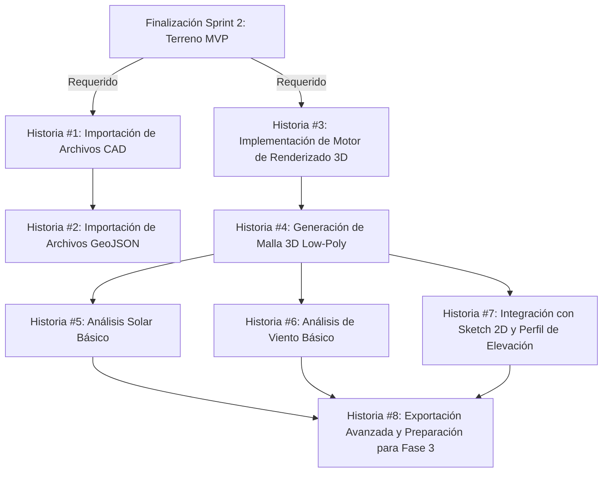

# Plan de Implementación: E2 - Terreno Completo (Sprint 3)

> **Propósito**: Este documento presenta el plan detallado de implementación para completar la Épica E2 (Terreno) durante el Sprint 3 del proyecto de calculadora inmobiliaria v2. Servirá como guía y registro del progreso para garantizar una entrega exitosa de la importación CAD y vista 3D low-poly.

## Visión General

En este Sprint 3 completaremos la Épica E2 (Terreno) implementando la funcionalidad para importar archivos CAD/GIS y generando una representación 3D low-poly del terreno con análisis básicos. Esto complementa el MVP desarrollado en el Sprint 2 y completa la experiencia de definición de terreno.

## Registro de Estado

| Fecha | Estado | Notas |
|-------|--------|-------|
| [FECHA_ACTUAL] | Planeado | Plan inicial creado |

## Historias de Usuario

### Historia #1: Importación de Archivos CAD

**Objetivo:** Implementar la funcionalidad para importar archivos CAD (DXF) y extraer geometría del terreno.

**Estado:** 📝 Pendiente

**Tareas:**
- [ ] Investigar y seleccionar biblioteca para parsing de archivos DXF
- [ ] Implementar UI para carga de archivos CAD
- [ ] Crear parser para extraer polígonos y datos relevantes
- [ ] Implementar validación de archivos y manejo de errores
- [ ] Convertir geometrías CAD al formato interno de la aplicación
- [ ] Añadir soporte para capas básicas (layers)

**Criterios de Aceptación:**
- [ ] Usuario puede cargar archivos DXF hasta 10MB
- [ ] Sistema extrae correctamente polígonos y líneas del archivo
- [ ] Se validan los archivos por formato y contenido antes de procesarlos
- [ ] UI muestra feedback durante la carga y procesamiento
- [ ] Se maneja correctamente formatos DXF comunes (R12, R14, 2000)
- [ ] Tests unitarios verifican la correcta extracción de geometría

**Dependencias:** Sketch 2D básico (Sprint 2)

**Desarrollador Asignado:** Edgar

### Historia #2: Importación de Archivos GeoJSON

**Objetivo:** Implementar la funcionalidad para importar archivos GeoJSON con datos geoespaciales.

**Estado:** 📝 Pendiente

**Tareas:**
- [ ] Implementar UI para carga de archivos GeoJSON
- [ ] Crear parser para GeoJSON y extracción de geometría
- [ ] Integrar con coordenadas geográficas y proyección
- [ ] Implementar validación de archivos GeoJSON
- [ ] Extraer propiedades y metadatos relevantes
- [ ] Añadir soporte para visualización preliminar

**Criterios de Aceptación:**
- [ ] Usuario puede cargar archivos GeoJSON hasta 5MB
- [ ] Sistema extrae correctamente polígonos, líneas y propiedades
- [ ] Las coordenadas se proyectan correctamente en el mapa
- [ ] UI muestra propiedades y atributos del GeoJSON de forma accesible
- [ ] Usuario puede seleccionar qué features importar en caso de múltiples
- [ ] Tests verifican la proyección y conversión de coordenadas

**Dependencias:** Historia #1

**Desarrollador Asignado:** Edgar

### Historia #3: Implementación de Motor de Renderizado 3D

**Objetivo:** Configurar motor de renderizado 3D (Babylon.js) y estructura base para visualización.

**Estado:** 📝 Pendiente

**Tareas:**
- [ ] Integrar Babylon.js en el proyecto
- [ ] Configurar escena 3D básica con cámara, luces y controles
- [ ] Implementar sistema de coordenadas y escalas
- [ ] Crear sistema de gestión de recursos 3D (texturas, materiales)
- [ ] Implementar optimizaciones para dispositivos móviles
- [ ] Añadir controles de navegación 3D accesibles

**Criterios de Aceptación:**
- [ ] Motor 3D se inicializa correctamente en desktop y dispositivos móviles
- [ ] Cámara y controles permiten navegación intuitiva en la escena
- [ ] FPS estable (mínimo 30fps) en dispositivos de gama media
- [ ] Sistema detecta y se adapta a capacidades del dispositivo
- [ ] UI incluye controles accesibles por teclado
- [ ] Tests verifican inicialización correcta en diferentes contextos

**Dependencias:** Ninguna del Sprint 3, pero requiere base del Sprint 2

**Desarrollador Asignado:** Edgar

### Historia #4: Generación de Malla 3D Low-Poly

**Objetivo:** Implementar algoritmo para convertir datos 2D del terreno en malla 3D low-poly.

**Estado:** 📝 Pendiente

**Tareas:**
- [ ] Implementar algoritmo de triangulación para polígonos 2D
- [ ] Crear generador de malla 3D a partir de triangulación
- [ ] Aplicar elevación y datos de altura al terreno
- [ ] Implementar sistema de LOD (nivel de detalle)
- [ ] Añadir texturas básicas al terreno
- [ ] Optimizar geometría para renderizado eficiente

**Criterios de Aceptación:**
- [ ] Sistema genera malla 3D correcta a partir de polígonos 2D
- [ ] El terreno refleja con precisión los datos de elevación
- [ ] La malla mantiene rendimiento óptimo con terrenos complejos
- [ ] La geometría se actualiza cuando cambia el polígono base
- [ ] Sistema utiliza LOD para optimizar rendimiento en visualización
- [ ] Tests unitarios verifican geometría generada

**Dependencias:** Historia #3

**Desarrollador Asignado:** Edgar

### Historia #5: Análisis Solar Básico

**Objetivo:** Implementar análisis solar básico para visualizar sombras en diferentes momentos del día/año.

**Estado:** 📝 Pendiente

**Tareas:**
- [ ] Implementar sistema de posicionamiento solar basado en coordenadas y fecha/hora
- [ ] Crear controles para selección de fecha y hora
- [ ] Implementar cálculo y visualización de sombras
- [ ] Añadir visualización de trayectoria solar
- [ ] Crear representación gráfica de horas de sol
- [ ] Implementar capturas/instantáneas del análisis

**Criterios de Aceptación:**
- [ ] Usuario puede seleccionar fecha y hora para análisis solar
- [ ] Las sombras se renderizan correctamente según la posición solar
- [ ] Sistema muestra trayectoria solar para la ubicación seleccionada
- [ ] Usuario puede visualizar análisis para diferentes épocas del año (solsticios/equinoccios)
- [ ] Análisis considera la ubicación geográfica del terreno
- [ ] Tests verifican cálculos de posición solar

**Dependencias:** Historia #4

**Desarrollador Asignado:** Edgar

### Historia #6: Análisis de Viento Básico

**Objetivo:** Implementar análisis básico de flujo de viento sobre el terreno.

**Estado:** 📝 Pendiente

**Tareas:**
- [ ] Implementar modelo simplificado de flujo de viento
- [ ] Crear controles para dirección e intensidad del viento
- [ ] Añadir visualización de vectores de viento
- [ ] Implementar cálculo básico de zonas de presión/succión
- [ ] Crear sistema de partículas para representación visual
- [ ] Optimizar para rendimiento en dispositivos objetivo

**Criterios de Aceptación:**
- [ ] Usuario puede configurar dirección e intensidad del viento
- [ ] Visualización muestra flujo de viento sobre el terreno
- [ ] Sistema indica zonas de presión/succión en el terreno
- [ ] La simulación es fluida (mínimo 20fps) en dispositivos objetivo
- [ ] La visualización es intuitiva y clara para el usuario
- [ ] Tests verifican la consistencia del modelo de viento

**Dependencias:** Historia #4

**Desarrollador Asignado:** Edgar

### Historia #7: Integración con Sketch 2D y Perfil de Elevación

**Objetivo:** Integrar flujos entre Sketch 2D, importaciones y vista 3D con perfiles de elevación.

**Estado:** 📝 Pendiente

**Tareas:**
- [ ] Implementar sincronización entre Sketch 2D y vista 3D
- [ ] Crear switch/toggle entre vistas 2D y 3D
- [ ] Implementar editor de perfil de elevación
- [ ] Añadir visualización de cortes transversales
- [ ] Sincronizar cambios en tiempo real entre vistas
- [ ] Implementar transiciones suaves entre modos

**Criterios de Aceptación:**
- [ ] Cambios en Sketch 2D se reflejan en tiempo real en vista 3D
- [ ] Usuario puede alternar fácilmente entre vistas 2D y 3D
- [ ] Editor de perfil de elevación modifica correctamente la vista 3D
- [ ] Visualización de cortes proporciona información de altura
- [ ] Sistema mantiene coherencia de datos entre vistas
- [ ] Tests de integración verifican sincronización entre interfaces

**Dependencias:** Historia #4, Sketch 2D del Sprint 2

**Desarrollador Asignado:** Edgar

### Historia #8: Exportación Avanzada y Preparación para Fase 3

**Objetivo:** Implementar exportación de geometría 3D y preparar la transición a la Fase 3.

**Estado:** 📝 Pendiente

**Tareas:**
- [ ] Implementar exportación de geometría 3D en formato glTF
- [ ] Crear sistema de guardado de análisis realizados
- [ ] Añadir exportación de capturas de análisis
- [ ] Implementar generación de informe básico (PDF)
- [ ] Crear validaciones previas al paso a Fase 3
- [ ] Diseñar UI de transición entre fases

**Criterios de Aceptación:**
- [ ] Usuario puede exportar geometría 3D en formato glTF
- [ ] Análisis y configuraciones se guardan correctamente
- [ ] Sistema permite capturas y exportación de visualizaciones
- [ ] Se genera informe básico con datos del terreno y análisis
- [ ] Sistema valida completitud antes de permitir avance a Fase 3
- [ ] Tests verifican formatos de exportación generados

**Dependencias:** Historias #5, #6, #7

**Desarrollador Asignado:** Edgar

## Riesgos y Mitigaciones

### Riesgo 1: Rendimiento 3D en Dispositivos de Gama Baja
**Descripción:** La visualización 3D y análisis pueden tener bajo rendimiento en dispositivos de gama baja o móviles.

**Mitigación:**
- Implementar sistema de LOD (Level of Detail) automático
- Crear modos de visualización simplificados para dispositivos limitados
- Optimizar geometría y texturas de forma agresiva
- Limitar efectos visuales y número de objetos en escena
- Añadir detección de rendimiento y ajustes automáticos

**Estado:** 🔍 Monitorizado

### Riesgo 2: Complejidad de Importación CAD
**Descripción:** Los archivos CAD pueden tener estructuras complejas y difíciles de interpretar correctamente.

**Mitigación:**
- Iniciar con soporte limitado para formatos/versiones más comunes
- Crear guía clara para usuarios sobre formatos soportados
- Implementar validaciones robustas para rechazar archivos incompatibles
- Tener flujo alternativo para entrada manual de datos
- Documentar claramente limitaciones conocidas

**Estado:** 🔍 Monitorizado

### Riesgo 3: Precisión de Análisis Solar/Viento
**Descripción:** Los análisis solares y de viento simplificados pueden carecer de precisión necesaria para decisiones reales.

**Mitigación:**
- Comunicar claramente que son análisis aproximados/educativos
- Añadir disclaimers sobre el uso para decisiones profesionales
- Verificar algoritmos con fuentes publicadas/conocidas
- Permitir incorporación futura de modelos más precisos
- Comparar resultados con herramientas validadas del mercado

**Estado:** 🔍 Monitorizado

### Riesgo 4: Curva de Aprendizaje para Usuarios
**Descripción:** Las herramientas 3D pueden resultar complejas para usuarios sin experiencia previa.

**Mitigación:**
- Crear tutoriales interactivos paso a paso
- Implementar controles simplificados con opciones avanzadas ocultas
- Añadir tooltips y guías contextuales
- Crear presets para operaciones comunes
- Proporcionar ejemplos y templates para referencia

**Estado:** 🔍 Monitorizado

## Estimación Total del Sprint

| Historia | Estimación (días) | Estado |
|----------|------------------|--------|
| #1: Importación de Archivos CAD | 1.0 | 📝 Pendiente |
| #2: Importación de Archivos GeoJSON | 0.5 | 📝 Pendiente |
| #3: Implementación de Motor de Renderizado 3D | 1.0 | 📝 Pendiente |
| #4: Generación de Malla 3D Low-Poly | 1.0 | 📝 Pendiente |
| #5: Análisis Solar Básico | 1.0 | 📝 Pendiente |
| #6: Análisis de Viento Básico | 0.5 | 📝 Pendiente |
| #7: Integración con Sketch 2D y Perfil de Elevación | 0.5 | 📝 Pendiente |
| #8: Exportación Avanzada y Preparación para Fase 3 | 0.5 | 📝 Pendiente |
| **Total** | **6.0** | 📝 **Pendiente** |

## Leyenda de Estado

- 📝 Pendiente: No iniciado
- 🏗️ En progreso: Desarrollo activo
- 🔍 Revisión: En proceso de revisión (PR abierto)
- ✅ Completado: Integrado en main y desplegado
- ❌ Bloqueado: No se puede avanzar debido a dependencias o problemas

## Diagrama de Dependencias

## Próximos Pasos

1. Revisar el plan con el equipo completo
2. Asignar desarrolladores a cada historia
3. Evaluar bibliotecas para importación CAD/GIS y renderizado 3D
4. Actualización diaria del estado en este documento
5. Preparar demostración para final del sprint
6. Planificar integración con E3 (Costos) para el siguiente sprint

---

> Este plan está sujeto a ajustes según el feedback del equipo y los desafíos encontrados durante la implementación. 