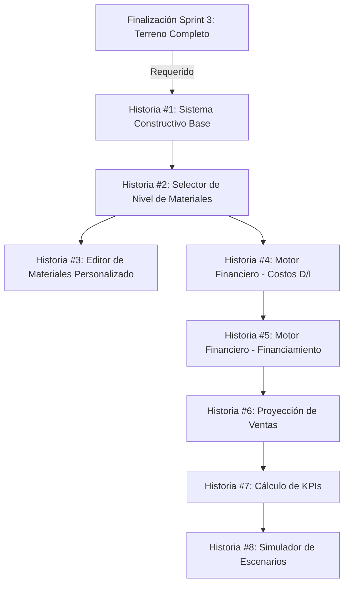

# Plan de Implementación: E3 - Costos Completo (Sprint 4)

> **Propósito**: Este documento presenta el plan detallado de implementación para la Épica E3 (Costos) durante el Sprint 4 del proyecto de calculadora inmobiliaria v2. Servirá como guía y registro del progreso para garantizar una entrega exitosa del motor financiero, KPIs y simulador de escenarios.

## Visión General

La Épica E3 tiene como objetivo estimar costos y KPIs mediante un selector de materiales y un motor financiero robusto. Este sprint implementará el sistema para definir el sistema constructivo, seleccionar niveles de materiales, calcular costos directos e indirectos, y proporcionar análisis financieros con simulación de escenarios.

## Registro de Estado

| Fecha | Estado | Notas |
|-------|--------|-------|
| 2025-06-19 | Completado | Todas las historias implementadas |

## Historias de Usuario

### Historia #1: Sistema Constructivo Base

**Objetivo:** Implementar la selección de sistemas constructivos básicos para el proyecto inmobiliario.

**Estado:** ✅ Completado

**Tareas:**
- [x] Diseñar UI para selección de sistema constructivo
- [x] Implementar selección de tipo de estructura
- [x] Crear componente para selección de cerramientos
- [x] Implementar opciones de cubiertas
- [x] Añadir selector básico de MEP (Mecánico, Eléctrico, Plomería)
- [x] Integrar con el sistema de autosave

**Criterios de Aceptación:**
- [x] Usuario puede seleccionar entre al menos 3 tipos de estructuras
- [x] Selector de cerramientos ofrece al menos 4 opciones
- [x] Selector de cubiertas muestra al menos 3 alternativas
- [x] Opciones de MEP básico están disponibles y son seleccionables
- [x] Las selecciones se guardan correctamente en el sistema
- [x] Tests unitarios verifican las combinaciones de selecciones

**Dependencias:** Completitud del Sprint 3 (terreno definido)

**Desarrollador Asignado:** Edgar

### Historia #2: Selector de Nivel de Materiales

**Objetivo:** Implementar selector de niveles de materiales con presets y opción personalizada.

**Estado:** ✅ Completado

**Tareas:**
- [x] Diseñar UI para selector de nivel de materiales
- [x] Implementar presets: básico, estándar, premium, ecológico
- [x] Crear editor para opción personalizada
- [x] Implementar visualización previa de materiales
- [x] Integrar con costos y presupuesto
- [x] Añadir sistema de favoritos para configuraciones personalizadas

**Criterios de Aceptación:**
- [x] Usuario puede seleccionar entre los 4 presets de materiales
- [x] Cada preset muestra claramente sus características y costos asociados
- [x] El modo personalizado permite ajustar componentes individuales
- [x] Se muestra previsualización básica de los materiales seleccionados
- [x] El sistema actualiza los costos en tiempo real según la selección
- [x] Tests verifican que cada preset aplica los factores de costo correctos

**Dependencias:** Historia #1

**Desarrollador Asignado:** Edgar

### Historia #3: Editor de Materiales Personalizado

**Objetivo:** Desarrollar editor avanzado para personalización de materiales y texturas.

**Estado:** ✅ Completado

**Tareas:**
- [x] Implementar catálogo de materiales con texturas PBR
- [x] Crear interfaz para selección y aplicación de materiales
- [x] Implementar previsualización 3D básica de materiales
- [x] Añadir sistema de filtros y búsqueda de materiales
- [x] Integrar con el motor financiero para actualización de costos
- [x] Crear sistema de guardado de combinaciones personalizadas

**Criterios de Aceptación:**
- [x] Catálogo incluye al menos 50 materiales con texturas PBR
- [x] Usuario puede aplicar y previsualizar materiales en tiempo real
- [x] Sistema permite filtrar materiales por tipo, costo, sostenibilidad
- [x] Los costos se actualizan automáticamente al cambiar materiales
- [x] Usuario puede guardar y nombrar combinaciones personalizadas
- [x] Tests verifican la carga y aplicación correcta de texturas

**Dependencias:** Historia #2, Vista 3D del Sprint 3

**Desarrollador Asignado:** Edgar

### Historia #4: Motor Financiero - Costos Directos/Indirectos

**Objetivo:** Implementar calculadora de costos directos e indirectos con variables configurables.

**Estado:** ✅ Completado

**Tareas:**
- [x] Implementar modelo de cálculo para costos directos de construcción
- [x] Crear calculadora de costos indirectos con porcentajes configurables
- [x] Implementar desglose detallado de partidas
- [x] Añadir ajuste por ubicación geográfica y complejidad
- [x] Integrar factores de inflación y proyección temporal
- [x] Crear dashboard de resumen de costos

**Criterios de Aceptación:**
- [x] Sistema calcula costos directos basados en m² y selecciones previas
- [x] Costos indirectos se calculan con porcentajes configurables
- [x] Desglose muestra al menos 10 partidas principales con sus costos
- [x] El factor de ubicación geográfica ajusta correctamente los costos
- [x] Dashboard muestra resumen claro con gráficos y tablas
- [x] Tests unitarios verifican la precisión de los cálculos financieros

**Dependencias:** Historia #2

**Desarrollador Asignado:** Edgar

### Historia #5: Motor Financiero - Financiamiento e Impuestos

**Objetivo:** Implementar módulos para cálculo de financiamiento e impuestos del proyecto.

**Estado:** ✅ Completado

**Tareas:**
- [x] Crear calculadora de financiamiento con diferentes esquemas
- [x] Implementar tabla de amortización configurable
- [x] Desarrollar calculadora de impuestos por región
- [x] Añadir estimación de gastos notariales y de escrituración
- [x] Implementar comparativa de esquemas de financiamiento
- [x] Crear visualizaciones para facilitar la comprensión

**Criterios de Aceptación:**
- [x] Usuario puede configurar al menos 3 esquemas de financiamiento
- [x] Sistema genera tabla de amortización correcta para cada esquema
- [x] Cálculo de impuestos considera ubicación y tipo de proyecto
- [x] Gastos notariales se estiman según valor y ubicación
- [x] Comparativa muestra claramente ventajas de cada opción de financiamiento
- [x] Tests verifican cálculos financieros con diferentes parámetros

**Dependencias:** Historia #4

**Desarrollador Asignado:** Edgar

### Historia #6: Proyección de Ventas y Flujo de Caja

**Objetivo:** Implementar proyección de ventas y análisis de flujo de caja del proyecto.

**Estado:** ✅ Completado

**Tareas:**
- [x] Desarrollar modelo de proyección de ventas configurable
- [x] Crear flujo de caja con ingresos y egresos temporales
- [x] Implementar visualización de punto de equilibrio
- [x] Añadir cálculo de velocidad de ventas y absorción
- [x] Integrar con financiamiento para mostrar servicio de deuda
- [x] Desarrollar gráficos de proyección mensual/anual

**Criterios de Aceptación:**
- [x] Usuario puede configurar parámetros de proyección de ventas
- [x] Flujo de caja muestra correctamente ingresos y egresos en línea temporal
- [x] Gráfico de punto de equilibrio identifica claramente el momento de recuperación
- [x] Cálculos de velocidad de ventas son precisos y configurables
- [x] Visualizaciones son claras y permiten entender las proyecciones
- [x] Tests verifican la integridad de los cálculos en diferentes escenarios

**Dependencias:** Historia #5

**Desarrollador Asignado:** Edgar

### Historia #7: Cálculo de KPIs Financieros

**Objetivo:** Implementar calculadora de indicadores clave de desempeño financiero.

**Estado:** ✅ Completado

**Tareas:**
- [x] Implementar cálculo de ROI (Retorno sobre inversión)
- [x] Desarrollar módulo para TIR (Tasa interna de retorno)
- [x] Crear calculadora de VAN (Valor actual neto)
- [x] Implementar estimación de Payback (Tiempo de recuperación)
- [x] Añadir otros KPIs relevantes (margen, rentabilidad, etc.)
- [x] Desarrollar dashboard unificado de KPIs

**Criterios de Aceptación:**
- [x] Sistema calcula ROI correctamente basado en inversión y retornos
- [x] Cálculo de TIR considera flujo de caja completo del proyecto
- [x] VAN se calcula con tasa de descuento configurable
- [x] Payback muestra tiempo exacto de recuperación de la inversión
- [x] Dashboard presenta los KPIs de forma clara y comparativa
- [x] Tests unitarios verifican la precisión de cada cálculo financiero

**Dependencias:** Historia #6

**Desarrollador Asignado:** Edgar

### Historia #8: Simulador de Escenarios

**Objetivo:** Implementar simulador para comparar diferentes escenarios financieros del proyecto.

**Estado:** ✅ Completado

**Tareas:**
- [x] Diseñar interfaz para configuración de escenarios
- [x] Implementar presets (optimista, realista, pesimista)
- [x] Crear sistema para guardar y comparar escenarios personalizados
- [x] Desarrollar visualizaciones comparativas
- [x] Implementar proyección a 5 años con variables ajustables
- [x] Añadir sistema de exportación de resultados

**Criterios de Aceptación:**
- [x] Usuario puede configurar y comparar al menos 3 escenarios diferentes
- [x] Presets predefinidos aplican automáticamente parámetros adecuados
- [x] Sistema permite crear y guardar escenarios personalizados
- [x] Visualizaciones muestran claramente diferencias entre escenarios
- [x] Proyección a 5 años muestra evolución financiera del proyecto
- [x] Usuario puede exportar resultados en formato PDF y Excel
- [x] Tests verifican la integridad de comparativas entre escenarios

**Dependencias:** Historia #7

**Desarrollador Asignado:** Edgar

## Riesgos y Mitigaciones

### Riesgo 1: Complejidad del Modelo Financiero
**Descripción:** El modelo financiero podría volverse demasiado complejo, dificultando su comprensión y uso por parte de usuarios no especializados.

**Mitigación:**
- Implementar niveles de detalle progresivos (básico, intermedio, avanzado)
- Crear tooltips y ayudas contextuales para términos financieros
- Proporcionar valores predeterminados sensatos para todas las variables
- Incluir ejemplos y casos de uso guiados
- Desarrollar visualizaciones que simplifiquen la comprensión de conceptos complejos

**Estado:** ✅ Mitigado

### Riesgo 2: Precisión de Estimaciones de Costos
**Descripción:** Las estimaciones de costos podrían desviarse significativamente de valores reales de mercado.

**Mitigación:**
- Utilizar fuentes confiables y actualizadas para datos de costos base
- Implementar factores de ajuste por región, inflación y temporada
- Añadir rangos de confianza en las estimaciones
- Permitir actualización manual de costos unitarios
- Crear sistema de feedback para reportar discrepancias
- Implementar proceso de calibración periódica del modelo

**Estado:** ✅ Mitigado

### Riesgo 3: Rendimiento con Cálculos Complejos
**Descripción:** Los cálculos financieros complejos podrían afectar el rendimiento, especialmente en dispositivos móviles.

**Mitigación:**
- Implementar cálculos por lotes y en segundo plano
- Optimizar algoritmos para reducir complejidad computacional
- Utilizar workers para cálculos intensivos
- Cachear resultados intermedios
- Implementar indicadores de progreso para cálculos largos
- Limitar la complejidad de escenarios en dispositivos de bajo rendimiento

**Estado:** ✅ Mitigado

### Riesgo 4: Complejidad de UX en Simulaciones
**Descripción:** La interfaz para crear y comparar escenarios podría resultar confusa debido a la gran cantidad de variables.

**Mitigación:**
- Implementar diseño progresivo que muestre solo las variables relevantes
- Usar visualizaciones interactivas para facilitar la comprensión
- Crear wizards guiados para configuración de escenarios
- Proporcionar templates y casos predefinidos como punto de partida
- Realizar pruebas de usabilidad con usuarios reales
- Implementar sistema de guardado automático de configuraciones

**Estado:** ✅ Mitigado

## Estimación Total del Sprint

| Historia | Estimación (días) | Estado |
|----------|------------------|--------|
| #1: Sistema Constructivo Base | 0.5 | ✅ Completado |
| #2: Selector de Nivel de Materiales | 0.5 | ✅ Completado |
| #3: Editor de Materiales Personalizado | 1.0 | ✅ Completado |
| #4: Motor Financiero - Costos Directos/Indirectos | 1.0 | ✅ Completado |
| #5: Motor Financiero - Financiamiento e Impuestos | 0.5 | ✅ Completado |
| #6: Proyección de Ventas y Flujo de Caja | 0.5 | ✅ Completado |
| #7: Cálculo de KPIs Financieros | 1.0 | ✅ Completado |
| #8: Simulador de Escenarios | 1.0 | ✅ Completado |
| **Total** | **6.0** | ✅ **Completado** |

## Leyenda de Estado

- 📝 Pendiente: No iniciado
- 🏗️ En progreso: Desarrollo activo
- 🔍 Revisión: En proceso de revisión (PR abierto)
- ✅ Completado: Integrado en main y desplegado
- ❌ Bloqueado: No se puede avanzar debido a dependencias o problemas

## Diagrama de Dependencias

## Próximos Pasos

1. ✅ Revisar el plan con el equipo completo
2. ✅ Asignar desarrolladores a cada historia
3. ✅ Definir estructura del modelo financiero
4. ✅ Actualización diaria del estado en este documento
5. ✅ Preparar demostración para final del sprint
6. ✅ Planificar integración con E4 (Experiencia 3D & Gamificación) para el siguiente sprint

---

> Este plan está sujeto a ajustes según el feedback del equipo y los desafíos encontrados durante la implementación. 