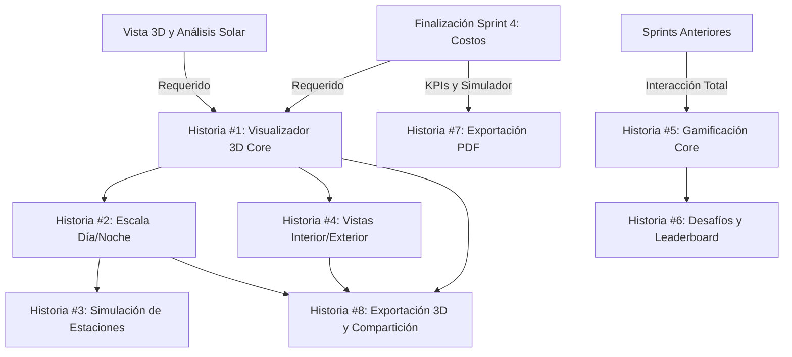

# Plan de Implementación: E4 - Experiencia 3D & Gamificación (Sprint 5)

> **Propósito**: Este documento presenta el plan detallado de implementación para la Épica E4 (Experiencia 3D & Gamificación) durante el Sprint 5 del proyecto de calculadora inmobiliaria v2. Servirá como guía y registro del progreso para garantizar una entrega exitosa del visualizador inmersivo 3D, gamificación inicial y exportación de resultados.

## Visión General

La Épica E4 busca proporcionar una experiencia inmersiva para explorar el proyecto inmobiliario en 3D, incorporar elementos de gamificación para aumentar el engagement del usuario y facilitar la exportación y compartición de resultados. Este sprint implementará el visualizador 3D con controles avanzados, badges de logros y opciones de exportación PDF con datos financieros.

## Registro de Estado

| Fecha | Estado | Notas |
|-------|--------|-------|
| [FECHA_ACTUAL] | Planeado | Plan inicial creado |

## Historias de Usuario

### Historia #1: Visualizador Inmersivo 3D Core

**Objetivo:** Desarrollar el núcleo del visualizador inmersivo 3D con funcionalidad básica de recorrido.

**Estado:** 📝 Pendiente

**Tareas:**
- [ ] Mejorar el motor de renderizado 3D con controles de cámara avanzados
- [ ] Implementar sistema de navegación tipo first-person y orbit
- [ ] Crear controles táctiles optimizados para dispositivos móviles
- [ ] Añadir sistema de colisiones para evitar atravesar superficies
- [ ] Implementar optimizaciones de rendimiento (occlusion culling)
- [ ] Añadir sistema básico de iluminación global

**Criterios de Aceptación:**
- [ ] Usuario puede recorrer el modelo 3D del proyecto con controles intuitivos
- [ ] Cambio fluido entre modos de cámara (first-person, orbit, top-down)
- [ ] Controles táctiles funcionan correctamente en dispositivos móviles
- [ ] El sistema mantiene mínimo 30fps en dispositivos de gama media
- [ ] La navegación respeta colisiones y limitaciones físicas
- [ ] Tests verifican la correcta inicialización y funcionamiento en diferentes dispositivos

**Dependencias:** Vista 3D low-poly (Sprint 3), Motor financiero (Sprint 4)

**Desarrollador Asignado:** Edgar

### Historia #2: Sistema de Escala Día/Noche

**Objetivo:** Implementar ciclo de día y noche con iluminación dinámica en el visualizador 3D.

**Estado:** 📝 Pendiente

**Tareas:**
- [ ] Implementar sistema de iluminación dinámica día/noche
- [ ] Crear controles para ajustar hora del día
- [ ] Añadir efectos visuales para amanecer/atardecer
- [ ] Implementar sistema de sombras dinámicas
- [ ] Incorporar cambios en la iluminación interior/exterior según hora
- [ ] Optimizar rendimiento de efectos de iluminación

**Criterios de Aceptación:**
- [ ] Usuario puede modificar la hora del día con un control intuitivo
- [ ] La iluminación y sombras se actualizan correctamente según la hora
- [ ] Efectos visuales especiales para amanecer/atardecer son visibles
- [ ] La iluminación interior se activa automáticamente en horas nocturnas
- [ ] El rendimiento se mantiene estable al cambiar entre configuraciones
- [ ] Tests verifican la correcta actualización de la iluminación

**Dependencias:** Historia #1

**Desarrollador Asignado:** Edgar

### Historia #3: Simulación de Estaciones

**Objetivo:** Implementar visualización de estaciones del año con cambios en entorno y vegetación.

**Estado:** 📝 Pendiente

**Tareas:**
- [ ] Crear sistema de cambio de estaciones (primavera, verano, otoño, invierno)
- [ ] Implementar modificaciones visuales a la vegetación según la estación
- [ ] Añadir efectos atmosféricos según temporada
- [ ] Implementar sistema de partículas para efectos estacionales
- [ ] Integrar con análisis solar del Sprint 3
- [ ] Optimizar carga de assets para distintas estaciones

**Criterios de Aceptación:**
- [ ] Usuario puede cambiar entre las 4 estaciones del año
- [ ] La vegetación muestra cambios visuales según la estación seleccionada
- [ ] Efectos atmosféricos (lluvia, nieve, niebla) se visualizan correctamente
- [ ] Se muestran cambios en la trayectoria solar según la estación
- [ ] El rendimiento se mantiene estable al cambiar entre estaciones
- [ ] La transición entre estaciones es visualmente fluida

**Dependencias:** Historia #2, Análisis solar (Sprint 3)

**Desarrollador Asignado:** Edgar

### Historia #4: Vistas Interior/Exterior

**Objetivo:** Implementar sistema para alternar entre vistas interiores y exteriores del proyecto.

**Estado:** 📝 Pendiente

**Tareas:**
- [ ] Implementar sistema de teletransporte entre puntos de interés
- [ ] Crear vistas predefinidas de exteriores desde ángulos estratégicos
- [ ] Implementar navegación interior con detección de habitaciones
- [ ] Añadir mini-mapa para ubicación durante el recorrido
- [ ] Crear sistema de etiquetas informativas en puntos clave
- [ ] Implementar transiciones suaves entre vistas

**Criterios de Aceptación:**
- [ ] Usuario puede alternar entre vista exterior e interior
- [ ] Sistema ofrece vistas predefinidas de puntos clave
- [ ] Navegación interior detecta habitaciones y espacios
- [ ] Mini-mapa muestra ubicación actual durante el recorrido
- [ ] Las etiquetas muestran información relevante sobre características
- [ ] Transiciones entre vistas son suaves y no desorientan al usuario

**Dependencias:** Historia #1

**Desarrollador Asignado:** Edgar

### Historia #5: Sistema de Gamificación Core

**Objetivo:** Implementar el sistema básico de gamificación con XP y badges iniciales.

**Estado:** 📝 Pendiente

**Tareas:**
- [ ] Diseñar sistema de experiencia (XP) y progresión
- [ ] Implementar sistema de badges/logros
- [ ] Crear primeros 10 badges para acciones comunes
- [ ] Implementar notificaciones de logros desbloqueados
- [ ] Añadir perfil de usuario para seguimiento de progreso
- [ ] Implementar persistencia de logros en sistema local

**Criterios de Aceptación:**
- [ ] Usuario gana XP por completar acciones específicas en la plataforma
- [ ] Sistema incluye al menos 10 badges iniciales desbloqueables
- [ ] Las notificaciones de logros son visualmente atractivas y no intrusivas
- [ ] Perfil de usuario muestra progreso, XP acumulado y badges obtenidos
- [ ] Los logros persisten entre sesiones usando almacenamiento local
- [ ] Tests verifican que los logros se desbloquean según las condiciones correctas

**Dependencias:** Historias de los sprints anteriores (interacción con todas las fases)

**Desarrollador Asignado:** Edgar

### Historia #6: Desafíos Mensuales y Leaderboard

**Objetivo:** Implementar sistema de desafíos periódicos y tabla de clasificación.

**Estado:** 📝 Pendiente

**Tareas:**
- [ ] Diseñar sistema de desafíos temporales
- [ ] Implementar al menos 3 desafíos iniciales
- [ ] Crear sistema de recompensas por completar desafíos
- [ ] Implementar leaderboard local con simulación de datos
- [ ] Añadir sistema de benchmarking de proyectos
- [ ] Crear visualizaciones comparativas

**Criterios de Aceptación:**
- [ ] Sistema muestra desafíos mensuales con objetivos claros
- [ ] Al menos 3 desafíos iniciales están disponibles
- [ ] Usuario recibe recompensas visuales por completar desafíos
- [ ] Leaderboard muestra ranking simulado con proyectos ficticios
- [ ] Sistema de benchmarking compara proyecto actual con promedios
- [ ] Tests verifican la correcta asignación de puntos y rankings

**Dependencias:** Historia #5

**Desarrollador Asignado:** Edgar

### Historia #7: Exportación PDF Financiero

**Objetivo:** Implementar sistema de exportación de informes financieros en PDF.

**Estado:** 📝 Pendiente

**Tareas:**
- [ ] Implementar generador de documentos PDF
- [ ] Diseñar plantilla de informe financiero
- [ ] Crear sistema para incluir gráficos y tablas de KPIs
- [ ] Implementar selección de datos a incluir en el informe
- [ ] Añadir opción de personalización básica (logo, colores)
- [ ] Crear sistema de preview antes de exportar

**Criterios de Aceptación:**
- [ ] Usuario puede exportar informe financiero completo en PDF
- [ ] Informe incluye correctamente tablas, gráficos y datos del proyecto
- [ ] Sistema permite seleccionar qué secciones incluir en el informe
- [ ] PDF generado es visualmente profesional y bien formateado
- [ ] Opciones básicas de personalización funcionan correctamente
- [ ] Vista previa muestra con precisión cómo quedará el PDF final

**Dependencias:** KPIs y simulador de escenarios (Sprint 4)

**Desarrollador Asignado:** Edgar

### Historia #8: Exportación 3D y Compartición Social

**Objetivo:** Implementar exportación de modelo 3D y opciones para compartir resultados.

**Estado:** 📝 Pendiente

**Tareas:**
- [ ] Implementar exportación de modelo 3D en formato glTF
- [ ] Crear sistema para generar capturas del modelo
- [ ] Implementar tour de video automático
- [ ] Añadir opciones para compartir en redes sociales
- [ ] Crear sistema de generación de enlaces compartibles
- [ ] Implementar opciones de exportación con diferentes niveles de detalle

**Criterios de Aceptación:**
- [ ] Usuario puede exportar modelo 3D en formato glTF
- [ ] Sistema permite capturar imágenes desde cualquier ángulo
- [ ] Tour automático genera video de recorrido por puntos clave
- [ ] Opciones para compartir en redes sociales funcionan correctamente
- [ ] Enlaces compartibles incluyen vista previa y datos básicos
- [ ] Usuario puede seleccionar nivel de detalle para exportaciones

**Dependencias:** Historia #1, #2, #4

**Desarrollador Asignado:** Edgar

## Riesgos y Mitigaciones

### Riesgo 1: Rendimiento del Visualizador 3D en Navegadores Web
**Descripción:** El visualizador 3D podría tener bajo rendimiento en navegadores web, especialmente en dispositivos móviles o con gráficas integradas.

**Mitigación:**
- Implementar sistema adaptativo de LOD (Level of Detail)
- Crear versión simplificada para dispositivos de bajo rendimiento
- Utilizar técnicas de carga progresiva para texturas y geometrías
- Implementar opciones de configuración de calidad
- Optimizar agresivamente shaders y efectos visuales
- Utilizar instancing para elementos repetitivos

**Estado:** 🔍 Monitorizado

### Riesgo 2: Compatibilidad WebGL entre Navegadores
**Descripción:** Problemas de compatibilidad entre diferentes navegadores y versiones de WebGL podrían causar inconsistencias visuales o fallos.

**Mitigación:**
- Implementar detección temprana de capacidades WebGL
- Crear fallbacks para características no soportadas
- Testear en múltiples navegadores y versiones
- Mantener un conjunto core de características garantizadas
- Proporcionar mensaje claro cuando un navegador no es compatible
- Documentar requisitos mínimos de sistema

**Estado:** 🔍 Monitorizado

### Riesgo 3: Tamaño de Descarga y Tiempo de Carga
**Descripción:** Assets 3D, texturas y lógica compleja podrían resultar en tiempos de carga prolongados y consumo excesivo de datos.

**Mitigación:**
- Implementar sistema de streaming de assets
- Comprimir texturas con formatos eficientes (basis, etc.)
- Utilizar LOD para cargar detalles progresivamente
- Implementar carga diferida de características no críticas
- Crear indicadores de progreso de carga informativos
- Cachear assets descargados para futuras visitas

**Estado:** 🔍 Monitorizado

### Riesgo 4: Equilibrio del Sistema de Gamificación
**Descripción:** El sistema de gamificación podría resultar demasiado intrusivo, trivial o no aportar verdadero valor al usuario.

**Mitigación:**
- Realizar pruebas de usuario para calibrar dificultad y valor percibido
- Asegurar que las recompensas tengan beneficios tangibles
- Permitir desactivar elementos de gamificación para usuarios profesionales
- Implementar sistema progresivo que no abrume a nuevos usuarios
- Diseñar desafíos que fomenten buenas prácticas en diseño inmobiliario
- Recibir feedback continuo durante la implementación

**Estado:** 🔍 Monitorizado

## Estimación Total del Sprint

| Historia | Estimación (días) | Estado |
|----------|------------------|--------|
| #1: Visualizador Inmersivo 3D Core | 1.5 | 📝 Pendiente |
| #2: Sistema de Escala Día/Noche | 0.5 | 📝 Pendiente |
| #3: Simulación de Estaciones | 0.5 | 📝 Pendiente |
| #4: Vistas Interior/Exterior | 1.0 | 📝 Pendiente |
| #5: Sistema de Gamificación Core | 1.0 | 📝 Pendiente |
| #6: Desafíos Mensuales y Leaderboard | 0.5 | 📝 Pendiente |
| #7: Exportación PDF Financiero | 0.5 | 📝 Pendiente |
| #8: Exportación 3D y Compartición Social | 0.5 | 📝 Pendiente |
| **Total** | **6.0** | 📝 **Pendiente** |

## Leyenda de Estado

- 📝 Pendiente: No iniciado
- 🏗️ En progreso: Desarrollo activo
- 🔍 Revisión: En proceso de revisión (PR abierto)
- ✅ Completado: Integrado en main y desplegado
- ❌ Bloqueado: No se puede avanzar debido a dependencias o problemas

## Diagrama de Dependencias

## Próximos Pasos

1. Revisar el plan con el equipo completo
2. Asignar desarrolladores a cada historia
3. Evaluar bibliotecas para exportación de PDF y modelos 3D
4. Crear sistema de pruebas específicas para rendimiento 3D
5. Actualización diaria del estado en este documento
6. Preparar demostración para final del sprint
7. Planificar fase final de hardening y QA para el Sprint 6

---

> Este plan está sujeto a ajustes según el feedback del equipo y los desafíos encontrados durante la implementación. 