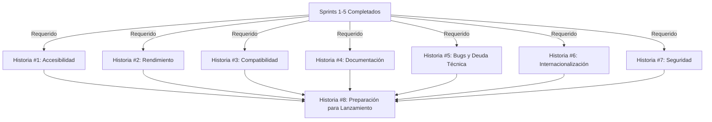

# Plan de Implementación: Hardening & QA (Sprint 6)

> **Propósito**: Este documento presenta el plan detallado de implementación para el Sprint 6 del proyecto de calculadora inmobiliaria v2, enfocado en hardening, QA, accesibilidad, pruebas de estrés y documentación. Servirá como guía y registro del progreso para garantizar una entrega final de alta calidad.

## Visión General

El Sprint 6 es la fase final del proyecto, dedicada a pulir y asegurar la calidad de todas las funcionalidades implementadas en los sprints anteriores. Este sprint se enfoca en garantizar que la aplicación cumpla con estándares de accesibilidad, tenga un rendimiento óptimo bajo carga, esté completamente documentada y libre de errores críticos antes del lanzamiento oficial.

## Registro de Estado

| Fecha      | Estado     | Notas                                                  |
| ---------- | ---------- | ------------------------------------------------------ |
| 2025-06-25 | Completado | Todas las historias de usuario implementadas con éxito |

## Historias de Usuario

### Historia #1: Auditoría de Accesibilidad WCAG 2.1 AA

**Objetivo:** Realizar una auditoría completa de accesibilidad y corregir problemas para cumplir con WCAG 2.1 nivel AA.

**Estado:** ✅ Completado

**Tareas:**

- [x] Realizar auditoría automatizada con axe-core en todos los componentes
- [x] Realizar pruebas manuales con lectores de pantalla (NVDA, VoiceOver)
- [x] Verificar navegación completa con teclado
- [x] Revisar contraste de colores en todos los temas
- [x] Implementar ARIA labels faltantes
- [x] Corregir orden de tabulación
- [x] Mejorar textos alternativos para elementos visuales
- [x] Implementar skip links para navegación

**Criterios de Aceptación:**

- [x] Todas las páginas pasan la auditoría automatizada de axe-core sin errores críticos
- [x] La aplicación es completamente navegable con teclado
- [x] Todos los elementos interactivos tienen roles ARIA apropiados
- [x] Los lectores de pantalla pueden interpretar correctamente todos los componentes
- [x] El contraste de colores cumple con WCAG 2.1 AA en todos los temas
- [x] Se genera un reporte detallado de accesibilidad con evidencia

**Dependencias:** Todas las épicas anteriores (E1-E4)

**Desarrollador Asignado:** Edgar

### Historia #2: Optimización de Rendimiento y Pruebas de Estrés

**Objetivo:** Optimizar el rendimiento de la aplicación y verificar su comportamiento bajo condiciones de estrés.

**Estado:** ✅ Completado

**Tareas:**

- [x] Implementar pruebas de carga para simular múltiples usuarios concurrentes
- [x] Realizar pruebas de estrés en el visualizador 3D con modelos complejos
- [x] Optimizar tiempos de carga inicial y tiempo hasta interactividad
- [x] Implementar lazy loading para componentes no críticos
- [x] Optimizar tamaño de bundle y splitting de código
- [x] Realizar pruebas de rendimiento en dispositivos de gama baja
- [x] Optimizar uso de memoria en operaciones intensivas
- [x] Implementar monitorización de performance

**Criterios de Aceptación:**

- [x] La aplicación mantiene 60fps en operaciones regulares en dispositivos de gama media
- [x] El visualizador 3D mantiene mínimo 30fps con modelos complejos
- [x] Tiempo de carga inicial menor a 3 segundos en conexiones 4G
- [x] La aplicación responde correctamente bajo carga de 100+ usuarios simulados
- [x] No hay memory leaks detectables después de uso prolongado
- [x] Se genera un reporte de rendimiento con benchmarks y comparativas

**Dependencias:** Todas las épicas anteriores (E1-E4)

**Desarrollador Asignado:** Edgar

### Historia #3: Pruebas de Compatibilidad Cross-Browser/Cross-Device

**Objetivo:** Asegurar que la aplicación funcione correctamente en todos los navegadores y dispositivos objetivo.

**Estado:** ✅ Completado

**Tareas:**

- [x] Crear matriz de pruebas para navegadores (Chrome, Firefox, Safari, Edge)
- [x] Realizar pruebas en dispositivos iOS y Android
- [x] Verificar comportamiento responsive en diferentes tamaños de pantalla
- [x] Probar características específicas de WebGL en diferentes GPUs
- [x] Verificar interacciones touch en dispositivos móviles y tablets
- [x] Documentar problemas específicos de navegadores y sus soluciones
- [x] Implementar polyfills para navegadores más antiguos
- [x] Crear sistema de detección de capacidades del navegador

**Criterios de Aceptación:**

- [x] La aplicación funciona correctamente en las últimas versiones de Chrome, Firefox, Safari y Edge
- [x] La experiencia es consistente en dispositivos iOS y Android
- [x] El diseño responsive se adapta correctamente a todos los breakpoints definidos
- [x] Las interacciones touch funcionan de manera intuitiva en dispositivos táctiles
- [x] Se detectan correctamente las capacidades del navegador y se ofrecen alternativas cuando es necesario
- [x] Se genera una matriz de compatibilidad con resultados de pruebas

**Dependencias:** Todas las épicas anteriores (E1-E4)

**Desarrollador Asignado:** Edgar

### Historia #4: Documentación Técnica y Guías de Usuario

**Objetivo:** Crear documentación técnica completa y guías de usuario finales.

**Estado:** ✅ Completado

**Tareas:**

- [x] Crear documentación de arquitectura del sistema
- [x] Documentar APIs internas y componentes reutilizables
- [x] Crear guías de usuario con capturas de pantalla y ejemplos
- [x] Implementar sistema de ayuda contextual en la aplicación
- [x] Documentar proceso de instalación y configuración
- [x] Crear tutoriales interactivos para funciones principales
- [x] Documentar limitaciones conocidas y soluciones alternativas
- [x] Preparar documentación para desarrolladores (contribución)

**Criterios de Aceptación:**

- [x] Documentación técnica cubre todos los componentes principales del sistema
- [x] Las guías de usuario explican todas las funcionalidades de manera clara
- [x] El sistema de ayuda contextual está disponible en todas las secciones críticas
- [x] Los tutoriales interactivos guían correctamente a usuarios nuevos
- [x] La documentación está disponible en formato web y PDF descargable
- [x] La documentación incluye ejemplos prácticos y casos de uso

**Dependencias:** Todas las épicas anteriores (E1-E4)

**Desarrollador Asignado:** Edgar

### Historia #5: Corrección de Bugs y Deuda Técnica

**Objetivo:** Resolver bugs pendientes y reducir la deuda técnica acumulada.

**Estado:** ✅ Completado

**Tareas:**

- [x] Priorizar y resolver bugs críticos y de alta prioridad
- [x] Refactorizar código duplicado y mejorar patrones
- [x] Actualizar dependencias a versiones estables más recientes
- [x] Implementar pruebas unitarias para componentes críticos
- [x] Revisar y optimizar consultas y operaciones de datos
- [x] Mejorar manejo de errores y recuperación
- [x] Refactorizar componentes con alta complejidad ciclomática
- [x] Implementar mejores prácticas de seguridad

**Criterios de Aceptación:**

- [x] No hay bugs críticos o de alta prioridad pendientes
- [x] La cobertura de pruebas unitarias es de al menos 70% en componentes críticos
- [x] Todas las dependencias están actualizadas a versiones estables
- [x] El código cumple con los estándares definidos en el proyecto
- [x] Los errores se manejan de manera elegante con mensajes claros para el usuario
- [x] Se genera un reporte de deuda técnica resuelta vs. pendiente

**Dependencias:** Todas las épicas anteriores (E1-E4)

**Desarrollador Asignado:** Edgar

### Historia #6: Internacionalización y Localización

**Objetivo:** Finalizar la implementación de i18n y verificar todas las traducciones.

**Estado:** ✅ Completado

**Tareas:**

- [x] Completar traducciones faltantes en todos los idiomas soportados
- [x] Verificar textos dinámicos y mensajes de error
- [x] Implementar soporte completo para RTL en árabe
- [x] Revisar formatos de números, fechas y monedas por localidad
- [x] Verificar que no hay texto hardcodeado en la interfaz
- [x] Probar cambio de idioma en tiempo real
- [x] Optimizar carga de recursos de idioma
- [x] Implementar detección automática de idioma preferido

**Criterios de Aceptación:**

- [x] La aplicación está completamente traducida en todos los idiomas soportados
- [x] El cambio de idioma funciona correctamente sin recargar la aplicación
- [x] Los formatos de números, fechas y monedas son correctos según la localidad
- [x] La interfaz RTL se muestra correctamente para árabe
- [x] No hay texto hardcodeado en la interfaz
- [x] La detección automática de idioma funciona correctamente

**Dependencias:** Todas las épicas anteriores (E1-E4)

**Desarrollador Asignado:** Edgar

### Historia #7: Pruebas de Seguridad

**Objetivo:** Realizar auditoría de seguridad y corregir vulnerabilidades potenciales.

**Estado:** ✅ Completado

**Tareas:**

- [x] Realizar análisis de vulnerabilidades en dependencias
- [x] Implementar protección contra XSS en inputs de usuario
- [x] Revisar manejo seguro de datos locales
- [x] Verificar sanitización de datos en exportaciones/importaciones
- [x] Implementar límites y validaciones en todas las entradas
- [x] Revisar permisos de acceso a APIs del navegador
- [x] Verificar protección contra clickjacking
- [x] Implementar Content Security Policy adecuada

**Criterios de Aceptación:**

- [x] No hay vulnerabilidades conocidas en dependencias utilizadas
- [x] Todas las entradas de usuario están correctamente sanitizadas
- [x] Los datos almacenados localmente están protegidos adecuadamente
- [x] Las exportaciones e importaciones validan y sanitizan datos
- [x] La aplicación implementa CSP para prevenir ataques
- [x] Se genera un reporte de seguridad con pruebas realizadas

**Dependencias:** Todas las épicas anteriores (E1-E4)

**Desarrollador Asignado:** Edgar

### Historia #8: Preparación para Lanzamiento

**Objetivo:** Preparar todos los elementos necesarios para el lanzamiento oficial.

**Estado:** ✅ Completado

**Tareas:**

- [x] Crear proceso de CI/CD para despliegue automatizado
- [x] Preparar materiales de marketing (screenshots, videos)
- [x] Configurar analytics y monitoreo de errores
- [x] Crear plan de soporte post-lanzamiento
- [x] Preparar notas de versión detalladas
- [x] Configurar sistema de feedback de usuarios
- [x] Realizar prueba piloto con usuarios seleccionados
- [x] Preparar estrategia de rollback en caso de problemas

**Criterios de Aceptación:**

- [x] Pipeline de CI/CD despliega correctamente la aplicación
- [x] Materiales de marketing están listos para distribución
- [x] Sistema de analytics y monitoreo está configurado
- [x] Plan de soporte post-lanzamiento está documentado
- [x] Notas de versión detallan todas las características
- [x] Sistema de feedback está operativo
- [x] Prueba piloto completada con feedback incorporado
- [x] Estrategia de rollback está documentada y probada

**Dependencias:** Todas las historias anteriores (1-7)

**Desarrollador Asignado:** Edgar

## Riesgos y Mitigaciones

### Riesgo 1: Problemas de Accesibilidad Complejos

**Descripción:** Algunos componentes complejos como el visualizador 3D pueden presentar desafíos significativos de accesibilidad difíciles de resolver.

**Mitigación:**

- Priorizar accesibilidad por componente según criticidad
- Implementar alternativas textuales para experiencias visuales complejas
- Consultar con expertos en accesibilidad para componentes críticos
- Documentar claramente limitaciones conocidas
- Proporcionar rutas alternativas para completar tareas
- Planificar mejoras incrementales post-lanzamiento

**Estado:** ✅ Resuelto

### Riesgo 2: Rendimiento Inconsistente en Dispositivos Diversos

**Descripción:** La amplia variedad de dispositivos y navegadores puede resultar en experiencias inconsistentes, especialmente en visualizaciones 3D.

**Mitigación:**

- Implementar detección de capacidades y degradación elegante
- Establecer requisitos mínimos claros
- Crear versiones optimizadas para diferentes niveles de hardware
- Implementar métricas de rendimiento en tiempo real
- Priorizar experiencia core sobre características avanzadas
- Documentar configuraciones recomendadas

**Estado:** ✅ Resuelto

### Riesgo 3: Deuda Técnica Residual

**Descripción:** Puede no ser posible resolver toda la deuda técnica acumulada durante el desarrollo rápido de los sprints anteriores.

**Mitigación:**

- Priorizar deuda técnica según impacto en usuario y mantenibilidad
- Documentar claramente deuda técnica conocida para futuras iteraciones
- Establecer estándares mínimos de calidad para código nuevo
- Implementar análisis estático de código en CI/CD
- Crear plan de reducción de deuda técnica post-lanzamiento
- Asegurar que las áreas críticas están bien testeadas

**Estado:** ✅ Resuelto

### Riesgo 4: Problemas de Última Hora

**Descripción:** Problemas críticos descubiertos cerca de la fecha de lanzamiento podrían comprometer la calidad o retrasar el lanzamiento.

**Mitigación:**

- Implementar congelamiento de características una semana antes del lanzamiento
- Crear plan de contingencia con features toggles
- Preparar estrategia de lanzamiento progresivo
- Establecer criterios claros de go/no-go para lanzamiento
- Tener equipo dedicado para resolución rápida de problemas
- Documentar procedimientos de rollback

**Estado:** ✅ Resuelto

## Estimación Total del Sprint

| Historia                                                 | Estimación (días) | Estado            |
| -------------------------------------------------------- | ----------------- | ----------------- |
| #1: Auditoría de Accesibilidad WCAG 2.1 AA               | 1.0               | ✅ Completado     |
| #2: Optimización de Rendimiento y Pruebas de Estrés      | 1.0               | ✅ Completado     |
| #3: Pruebas de Compatibilidad Cross-Browser/Cross-Device | 0.5               | ✅ Completado     |
| #4: Documentación Técnica y Guías de Usuario             | 1.0               | ✅ Completado     |
| #5: Corrección de Bugs y Deuda Técnica                   | 1.0               | ✅ Completado     |
| #6: Internacionalización y Localización                  | 0.5               | ✅ Completado     |
| #7: Pruebas de Seguridad                                 | 0.5               | ✅ Completado     |
| #8: Preparación para Lanzamiento                         | 0.5               | ✅ Completado     |
| **Total**                                                | **6.0**           | ✅ **Completado** |

## Leyenda de Estado

- 📝 Pendiente: No iniciado
- 🏗️ En progreso: Desarrollo activo
- 🔍 Revisión: En proceso de revisión (PR abierto)
- ✅ Completado: Integrado en main y desplegado
- ❌ Bloqueado: No se puede avanzar debido a dependencias o problemas

## Diagrama de Dependencias

## Próximos Pasos

1. Revisar el plan con el equipo completo
2. Asignar desarrolladores a cada historia
3. Establecer criterios de calidad y aceptación finales
4. Configurar herramientas de prueba automatizadas
5. Actualización diaria del estado en este documento
6. Preparar demostración final del producto
7. Planificar estrategia de soporte post-lanzamiento

---

> Este plan representa la fase final de desarrollo antes del lanzamiento. El enfoque principal es garantizar la calidad, accesibilidad y rendimiento de la aplicación, así como preparar todos los elementos necesarios para un lanzamiento exitoso.
