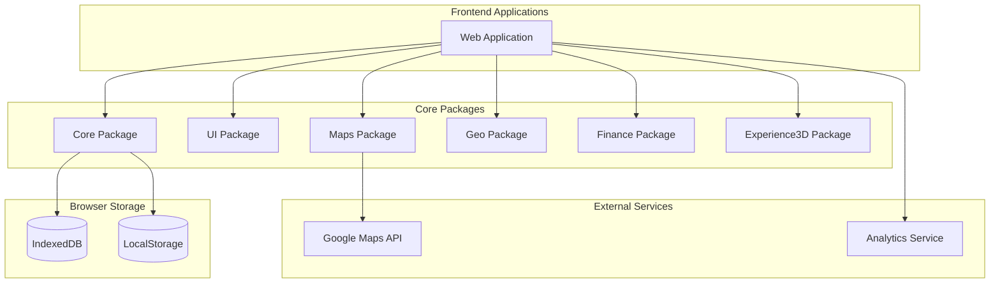
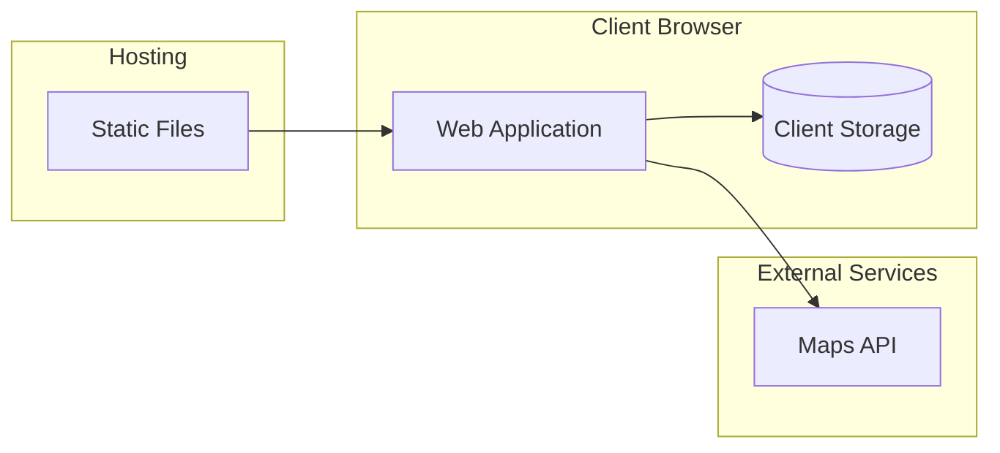

# Beyond Solutions Calculator - System Architecture

> **Document Purpose**: This document provides a comprehensive overview of the system architecture for the Beyond Solutions Calculator application. It serves as a reference for developers, architects, and stakeholders to understand the structure, components, and interactions within the system.

## 1. System Overview

The Beyond Solutions Calculator is a comprehensive web application designed to assist real estate professionals and clients in analyzing properties, calculating costs, and visualizing projects in 3D. The application follows a modular architecture organized as a monorepo, with clear separation of concerns and reusable components.

## 2. Architecture Diagram

## 3. Component Architecture

### 3.1 Web Application (`apps/web`)

The main web application that integrates all packages and provides the user interface. Built with React, TypeScript, and Tailwind CSS.

**Key Features:**
- User onboarding wizard
- Project dashboard
- Terrain selection and editing
- Cost calculation
- 3D visualization
- Export and sharing capabilities

### 3.2 Core Package (`packages/core`)

Provides fundamental functionality used across the application.

**Key Components:**
- Data storage and persistence layer
- Authentication utilities
- Internationalization (i18n) support
- Common utilities and helpers
- Autosave functionality

### 3.3 UI Package (`packages/ui`)

Contains reusable UI components shared across the application.

**Key Components:**
- Design system implementation
- Form components
- Navigation elements
- Layout components
- Modal and dialog components

### 3.4 Maps Package (`packages/maps`)

Handles map-related functionality and integration with mapping services.

**Key Components:**
- Map container and controls
- Search functionality
- Location selection
- Geolocation utilities

### 3.5 Geo Package (`packages/geo`)

Provides geospatial data processing and visualization capabilities.

**Key Components:**
- CAD/DXF file import
- GeoJSON processing
- Terrain 3D rendering
- File import/export utilities

### 3.6 Finance Package (`packages/finance`)

Handles financial calculations and cost estimation.

**Key Components:**
- Construction cost calculator
- Financing calculator
- ROI and KPI calculations
- Material cost estimation

### 3.7 Experience3D Package (`packages/experience3d`)

Provides immersive 3D visualization and interaction capabilities.

**Key Components:**
- Immersive 3D viewer
- Day/night lighting system
- Seasonal visualization
- View management
- Gamification system
- Export and sharing utilities

## 4. Data Flow

### 4.1 User Onboarding Flow

1. User enters the application
2. Completes wizard steps (profile selection, project type)
3. Data is stored in IndexedDB
4. User is directed to the dashboard

### 4.2 Terrain Selection Flow

1. User selects terrain source (map, catalog, or import)
2. If using map: selects location and draws boundaries
3. If importing: uploads CAD/DXF or GeoJSON file
4. Terrain data is processed and stored
5. 3D visualization is generated

### 4.3 Cost Calculation Flow

1. User selects construction system and materials
2. Inputs project parameters
3. Finance package calculates costs and projections
4. Results are displayed and can be exported

### 4.4 3D Experience Flow

1. User accesses 3D viewer with processed terrain data
2. Can toggle between day/night and seasons
3. Can navigate different views (interior/exterior)
4. Can complete challenges for gamification
5. Can export visualizations or share on social media

## 5. Technology Stack

### 5.1 Frontend

- **Framework**: React
- **Language**: TypeScript
- **Styling**: Tailwind CSS
- **State Management**: React Context API
- **Routing**: React Router
- **3D Rendering**: Babylon.js
- **Maps**: Google Maps API

### 5.2 Storage

- **Client-side Database**: IndexedDB (via Dexie.js)
- **Local Storage**: Browser's localStorage API

### 5.3 Build Tools

- **Package Manager**: npm/yarn
- **Bundler**: Webpack
- **Transpiler**: Babel
- **Linting**: ESLint
- **Testing**: Jest, Puppeteer

## 6. Cross-Cutting Concerns

### 6.1 Internationalization (i18n)

The application supports multiple languages through a comprehensive i18n system:
- Language files stored in JSON format
- Dynamic language switching
- RTL support for languages like Arabic
- Number and date formatting based on locale

### 6.2 Accessibility

The application follows WCAG 2.1 AA standards:
- Proper semantic HTML
- ARIA attributes
- Keyboard navigation
- Screen reader compatibility
- Color contrast compliance

### 6.3 Performance Optimization

- Code splitting and lazy loading
- Asset optimization
- Caching strategies
- Optimized 3D rendering
- Responsive design for all devices

### 6.4 Security

- Input validation
- Content Security Policy
- Secure local storage
- Dependency vulnerability scanning
- Protection against XSS attacks

## 7. Deployment Architecture

The application is deployed as a static web application, with all computation happening client-side:

## 8. Development Workflow

### 8.1 Local Development

1. Clone the monorepo
2. Install dependencies with `npm install`
3. Start development server with `npm run dev`
4. Access the application at `http://localhost:3000`

### 8.2 Building for Production

1. Run `npm run build`
2. Static files are generated in the `dist` directory
3. Deploy these files to a static hosting service

### 8.3 Testing

1. Unit tests: `npm run test:unit`
2. Integration tests: `npm run test:integration`
3. Accessibility tests: `npm run test:a11y`
4. Performance tests: `npm run test:performance`

## 9. Future Enhancements

- **Backend Integration**: Adding optional server-side functionality for data persistence
- **Collaboration Features**: Real-time collaboration between multiple users
- **Advanced Simulations**: Environmental impact and energy efficiency simulations
- **Mobile Applications**: Native mobile applications for iOS and Android
- **AI Recommendations**: Intelligent recommendations for design and materials

## 10. Conclusion

The Beyond Solutions Calculator architecture is designed for modularity, extensibility, and performance. The separation of concerns allows for independent development and testing of components, while the monorepo structure ensures consistency across the codebase.

---

*Document Version: 1.0*  
*Last Updated: 2025-06-25*  
*Authors: Beyond Solutions Development Team* 